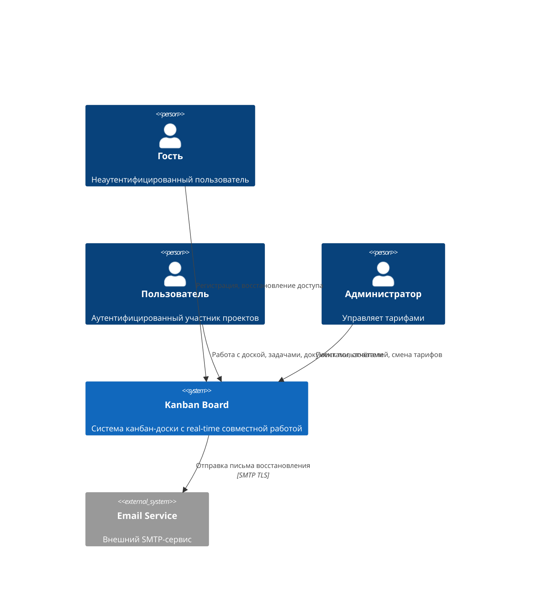
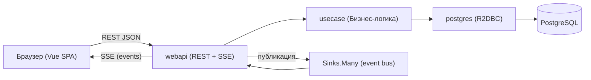
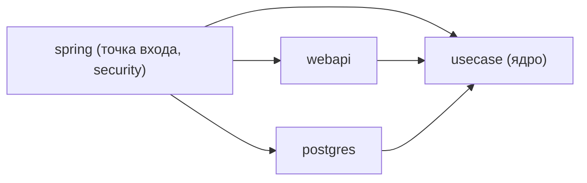
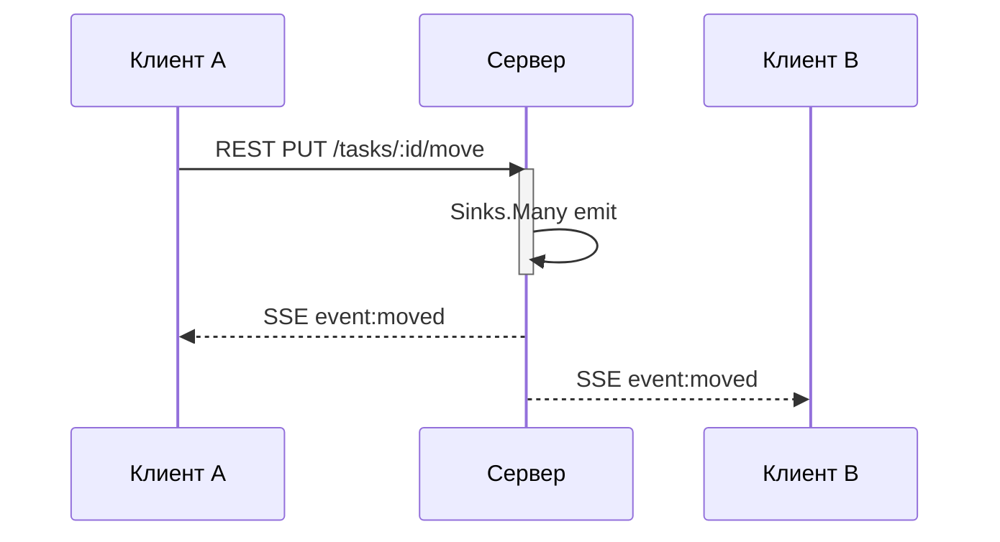

# Kanban Board — Архитектура и план разработки

## 1. Обзор

Многопользовательская Kanban-доска с real-time совместной работой, управлением задачами, документами, отчётами и гибкой системой прав доступа.

- **Мультимодульный монорепозиторий** — Gradle (Kotlin DSL) для бэкенда, npm/Vite для фронта.
- **Гексагональная архитектура** — ядро (`usecase`) не зависит от фреймворков, адаптеры ввода/вывода подключаются через DI.
- **Reactive стек** — Spring WebFlux, R2DBC, Project Reactor.
- **Единый API-контейнер** — REST + SSE + файлы в одном процессе (см. [ADR: C4 Container](docs/adr/260619-1200.md)).

---

## 2. Архитектура (C4)

### Контекст



Акторы: гость (регистрация), пользователь (работа с доской), администратор (управление тарифами).

Описание акторов и внешних систем — [docs/ai/domain/01-identity-and-access.md](docs/ai/domain/01-identity-and-access.md).

### Контейнеры

| Контейнер | Технологии | Назначение |
|---|---|---|
| **Web UI** | Vue 3 + TS + Vite + SCSS | SPA в браузере |
| **API Container** | Spring WebFlux + Kotlin | REST + SSE + файлы (единый процесс) |
| **Database** | PostgreSQL 16 | Реляционная БД (R2DBC) |
| **File Storage** | MinIO | S3-совместимое объектное хранилище |

Обоснование единого API-контейнера — [ADR: C4 Container](docs/adr/260619-1200.md#%D0%BF%D0%BE%D1%87%D0%B5%D0%BC%D1%83-api-sse-%D0%B8-%D1%84%D0%B0%D0%B9%D0%BB%D1%8B-%D0%B5%D0%B4%D0%B8%D0%BD%D1%8B%D0%B9-%D0%BA%D0%BE%D0%BD%D1%82%D0%B5%D0%B9%D0%BD%D0%B5%D1%80).

### Потоки данных



Протоколы: REST (CRUD), SSE (real-time), Multipart HTTP (файлы).

Обоснование выбора — [ADR: Протоколы взаимодействия](docs/adr/260619-0921.md).

---

## 3. Модули

### 3.1 Бэкенд (Gradle)

```
kanban/
├── spring/       # Точка входа: @SpringBootApplication, Security (JWT), Actuator, CORS, MDC
├── usecase/      # Ядро: доменные сущности, операции, порты (не зависит от других модулей)
├── webapi/       # Адаптер ввода: REST-контроллеры, SSE-эндпоинт, обработчики
├── postgres/     # Адаптер вывода: R2DBC-репозитории, Flyway-миграции
```

Детальная структура каждого модуля — [docs/ai/STRUCTURE.md](docs/ai/STRUCTURE.md).

**Зависимости:**



#### usecase (ядро)

Доменные пакеты:

| Пакет | Сущности | Описание |
|---|---|---|
| `identity` | User, Tariff, Session | Аутентификация, тарифы |
| `project` | Project, Column | Проекты, колонки досок |
| `task` | Task, Comment, FileAttachment | Задачи, комментарии, файлы |
| `document` | Document | Документы проекта |
| `access` | Group, Permission, Member | Группы, права доступа |
| `common` | — | Общие типы и value objects |

Полное описание предметных областей — [docs/ai/domain/](docs/ai/domain/).

Каждый доменный пакет содержит:
- `*Operation.kt` — интерфейс операции (CQRS: `Arg` / `Result`)
- `*OperationImpl.kt` — реализация (internal)
- `*Provider.kt` / `*Repository.kt` — порт вывода (реализация в postgres)
- `*Publisher.kt` — порт публикации событий (реализация в webapi, SSE)

#### webapi (адаптер ввода)

- REST-контроллеры: `src/main/kotlin/com/kanban/<domain>/` — по одному эндпоинту на файл
- SSE: `sse/SseController.kt`, `sse/SinkService.kt` — in-memory event bus через `Sinks.Many`
- Глобальный error handler, CORS-конфигурация
- Jackson-маппинг snake_case ↔ camelCase

Контракты API — [docs/ai/api/](docs/ai/api/).

#### postgres (адаптер вывода)

- R2DBC `@Table`-сущности
- Flyway-миграции: `src/main/resources/db/migration/V*.sql`
- `*RepositoryImpl` — реализация портов usecase

Схема БД — [docs/ai/dto/postgresql.md](docs/ai/dto/postgresql.md).

### 3.2 Фронтенд (npm/Vite)

```
vue/
├── src/
│   ├── main.ts         # Инициализация Vue + Pinia + Router
│   ├── App.vue         # Корневой компонент (router-view + навигация)
│   ├── router.ts       # Vue Router (createWebHistory, lazy-роуты, auth guard)
│   ├── fetch.ts        # API-клиент: нативный fetch, обёртка request<T>, JWT, 401 refresh
│   ├── pinia.ts        # Конфигурация Pinia (unused — createPinia в main.ts)
│   ├── style.scss      # CSS-переменные тем (светлая/тёмная), размеры, шрифты
│   ├── composables/    # useTheme, useBoards, useRealtime
│   ├── layout/         # Глобальные сетки страниц
│   ├── component/      # Глобальные компоненты (ProjectLayout.vue, CommentSystem, FileUpload)
│   └── module/         # Бизнес-модули
│       ├── auth/       # LoginPage, RegisterPage, ProfilePage, store, api
│       ├── project/    # ProjectListPage, ProjectSettingsPage, store, api
│       ├── board/      # BoardPage, Column.vue, store, api
│       ├── task/       # TaskCard, TaskDetailPage, CreateTaskModal, CommentSystem, FileUpload, store, api
│       ├── document/   # DocumentListPage, DocumentUpload, store, api
│       ├── access/     # AccessControlPage, PermissionEditor, store, api
│       ├── search/     # SearchPage, store, api
│       └── report/     # ReportsPage, store, api
```

UI-спецификация страниц — [docs/ai/ui/](docs/ai/ui/).
UI-спецификация компонентов — [docs/ai/ui/component-*.md](docs/ai/ui/).

### 3.3 E2E-тесты (Playwright)

```
e2etest/
├── specs/              # spec-файлы по доменам (auth, project, board, task, comment, file, document, access, search, report, realtime)
├── helpers/            # Вспомогательные функции (login, createBoardViaApi, toTask, toComment…)
└── playwright.config.ts
```

---

## 4. Протоколы взаимодействия

| Тип | Протокол | Формат | Аутентификация |
|---|---|---|---|
| CRUD | REST over HTTP/2 | JSON (snake_case) | Bearer JWT |
| Real-time | SSE | JSON-события | Bearer JWT (через cookie/header) |
| Файлы (загрузка) | Multipart HTTP | form-data | Bearer JWT |
| Файлы (скачивание) | S3 presigned URL | — | Подпись URL |

Детальное обоснование — [ADR: Протоколы взаимодействия](docs/adr/260619-0921.md).

### SSE (real-time)



- Event bus: `Sinks.Many<ProjectEvent>` (Project Reactor, in-memory)
- Буфер последних событий для восполнения пропущенных (Last-Event-ID)
- Sticky session на Nginx (Sinks.Many живут в памяти конкретного инстанса)
- Авто-переподключение: браузерный `EventSource`

Контракт real-time — [docs/ai/api/realtime.md](docs/ai/api/realtime.md).

### Файлы (MinIO)

- API выдаёт presigned URL для загрузки/скачивания
- Файлы передаются напрямую между браузером и MinIO (разгрузка API)
- В БД — только метаданные

Конфигурация MinIO — [docs/ai/dto/minio.md](docs/ai/dto/minio.md).

### Email (восстановление пароля)

- Внешний SMTP-сервис через порт `EmailSender` (usecase)
- Только восстановление пароля (пока)

Контракт — [docs/ai/contract/email-service.md](docs/ai/contract/email-service.md).

---

## 5. Технологический стек

| Компонент | Технология |
|---|---|
| Язык бэка | Kotlin 2.0.21 |
| Фреймворк | Spring Boot 3.3.5 (WebFlux, R2DBC, Security) |
| БД | PostgreSQL 16 |
| Файлы | MinIO (S3 API) |
| Реалтайм | SSE (Project Reactor Sinks.Many) |
| Фронт | Vue 3 + TypeScript + Vite 6 + Pinia + SCSS |
| E2E | Playwright |
| Контейнеризация | Docker, Docker Compose |
| Сборка | Gradle 8.14.1 (Kotlin DSL), npm |
| Линтеры | Ktlint, Detekt, ESLint, Prettier |
| JVM | Java 21 |

Полный перечень нефункциональных требований — [docs/ai/NON_FUNCTIONAL_REQUIRMENTS.md](docs/ai/NON_FUNCTIONAL_REQUIRMENTS.md).

---

## 6. Функциональные модули

| Модуль | Статус | Документация |
|---|---|---|
| Аутентификация | Реализовано (TOTP отложен) | [usecase](docs/ai/usecase/01-auth-and-profile.md), [UI](docs/ai/ui/01-login.md) |
| Проекты и доски | Реализовано | [usecase](docs/ai/usecase/02-project-management.md), [UI](docs/ai/ui/05-projects.md) |
| Задачи, комментарии, файлы | Реализовано | [usecase](docs/ai/usecase/04-task-operations.md), [UI](docs/ai/ui/06-board.md) |
| Документы | Реализовано | [usecase](docs/ai/usecase/06-documents.md), [UI](docs/ai/ui/09-documents.md) |
| Управление доступом | Реализовано | [usecase](docs/ai/usecase/08-access-control.md), [UI](docs/ai/ui/11-access-control.md) |
| Поиск | Реализовано | [usecase](docs/ai/usecase/05-filtering-and-search.md), [UI](docs/ai/ui/08-search.md) |
| Отчёты (CFD, Lead Time) | Реализовано | [usecase](docs/ai/usecase/07-reports.md), [UI](docs/ai/ui/10-reports.md) |
| Real-time (SSE) | Реализовано | [usecase](docs/ai/usecase/09-realtime.md), [API](docs/ai/api/realtime.md) |
| Администрирование | База реализована | [usecase](docs/ai/usecase/10-admin.md), [UI](docs/ai/ui/12-admin.md) |
| Bot-assignee | Не начат | [usecase](docs/ai/usecase/11-bot-assignee.md) |

Полные функциональные требования — [docs/ai/FUNCTIONAL_REQUIRMENTS.md](docs/ai/FUNCTIONAL_REQUIRMENTS.md).

---

## 7. План разработки

### Фаза 0 — Инфраструктура и каркас
- [x] Gradle-сборка, модули spring/usecase/webapi/postgres
- [x] Docker Compose (PostgreSQL, MinIO, API, Front)
- [x] Vue-каркас (Vite, Router, Pinia, fetch-клиент, SCSS-темы)
- [x] Playwright E2E-проект + фабрики данных

Детальный план — [docs/ai/IMPLEMENTATION_PLAN.md](docs/ai/IMPLEMENTATION_PLAN.md).

### Фаза 1 — Аутентификация
- [x] usecase: User, Tariff, Register, Login, Logout, Recovery
- [x] postgres: таблицы users, tariffs, user_tariffs, refresh_tokens
- [x] webapi: AuthController (register, login, refresh, logout, recovery)
- [x] vue: LoginPage, RegisterPage, ProfilePage, auth-store
- [➜] TOTP — отложено

### Фаза 2 — Проект и доска
- [x] usecase: Project, Column, Board
- [x] postgres: таблицы projects, columns
- [x] webapi: ProjectController, BoardController
- [x] vue: ProjectListPage, BoardPage, Column.vue, TaskCard.vue, swimlanes

### Фаза 3 — Задачи, комментарии, файлы
- [x] usecase: Task, Comment, FileAttachment
- [x] postgres: таблицы tasks, comments, file_attachments
- [x] webapi: TaskController, CommentController, FileController
- [x] vue: TaskDetailPage, CreateTaskModal, CommentSystem, FileUpload, DnD

### Фаза 4 — Документы
- [x] usecase + postgres: Document
- [x] webapi: DocumentController
- [x] vue: DocumentListPage, DocumentUpload

### Фаза 5 — Управление доступом
- [x] usecase + postgres: Group, Permission, Member
- [x] webapi: AccessHandler, PermissionCheck
- [x] vue: AccessControlPage, PermissionEditor

### Фаза 6 — Поиск и отчёты
- [x] usecase + postgres: Search (full-text), Reports (CFD, Lead Time)
- [x] webapi: SearchController, ReportController
- [x] vue: SearchPage, ReportsPage

### Фаза 7 — Real-time синхронизация (SSE)
- [x] webapi: SseController + SinkService (Sinks.Many)
- [x] Публикация 11 типов событий
- [x] vue: sseService.ts + useRealtime.ts
- [x] Оптимистичные обновления + откат

### Фаза 8 — Финализация
- [x] Production Docker Compose, скрипт деплоя
- [ ] Приёмочные тесты (checklist)

---

## 8. Запуск

```bash
# Продакшн
cp .env.example .env
docker compose up -d

# Локальная разработка с hot-reload
make dev

# Пересборка бэка
make update-back

# Пересборка фронта
make update-front

# E2E-тесты
make e2e
```

---

## 9. Ссылки

| Раздел | Файл |
|---|---|
| Исходные требования (заказчик) | [docs/human/SOURCE_CUSTOMER_REQUIRMENT.md](docs/human/SOURCE_CUSTOMER_REQUIRMENT.md) |
| Исходные требования (архитектор) | [docs/human/SOURCE_TECHNICAL_REQUIRMENT.md](docs/human/SOURCE_TECHNICAL_REQUIRMENT.md) |
| Исходные требования (дизайнер) | [docs/human/SOURCE_UI_UX_REQUIRMENT.md](docs/human/SOURCE_UI_UX_REQUIRMENT.md) |
| ADR: Протоколы | [docs/adr/260619-0921.md](docs/adr/260619-0921.md) |
| ADR: C4 Container | [docs/adr/260619-1200.md](docs/adr/260619-1200.md) |
| Функциональные требования | [docs/ai/FUNCTIONAL_REQUIRMENTS.md](docs/ai/FUNCTIONAL_REQUIRMENTS.md) |
| Нефункциональные требования | [docs/ai/NON_FUNCTIONAL_REQUIRMENTS.md](docs/ai/NON_FUNCTIONAL_REQUIRMENTS.md) |
| Структура проекта | [docs/ai/STRUCTURE.md](docs/ai/STRUCTURE.md) |
| План реализации | [docs/ai/IMPLEMENTATION_PLAN.md](docs/ai/IMPLEMENTATION_PLAN.md) |
| API-контракты | [docs/ai/api/](docs/ai/api/) |
| Предметные области | [docs/ai/domain/](docs/ai/domain/) |
| Схема БД | [docs/ai/dto/postgresql.md](docs/ai/dto/postgresql.md) |
| MinIO | [docs/ai/dto/minio.md](docs/ai/dto/minio.md) |
| Email-сервис | [docs/ai/contract/email-service.md](docs/ai/contract/email-service.md) |
| UI-спецификация | [docs/ai/ui/](docs/ai/ui/) |
| Сценарии использования | [docs/ai/usecase/](docs/ai/usecase/) |
| Пользовательские сценарии | [docs/ai/userstory/](docs/ai/userstory/) |
| TODO (текущий статус) | [TODO.md](TODO.md) |
| Отчёт о проекте | [REPORT.md](REPORT.md) |
