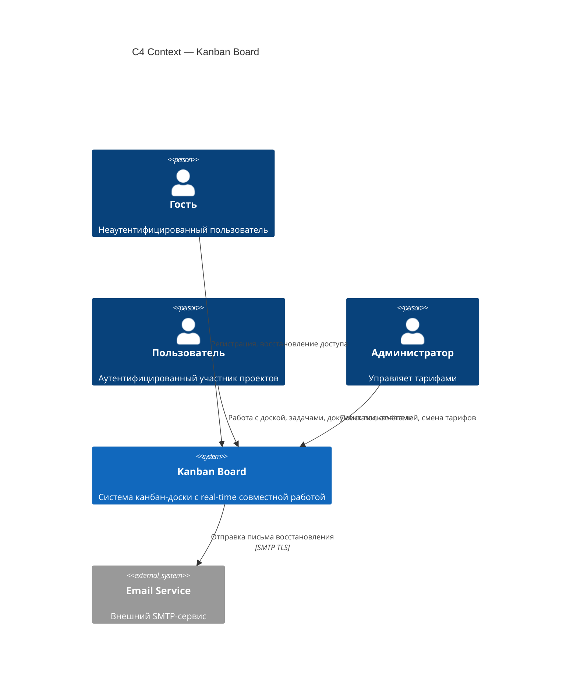
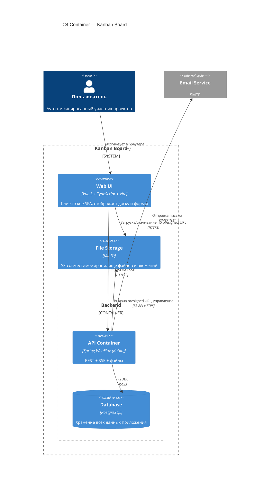

Статус: Принято

# C4 Context и Container диаграммы системы

## Контекст
Система — мультимодульная канбан-доска с real-time совместной работой. Для согласования архитектуры с заинтересованными сторонами и фиксации границ системы необходимо определить C4 Context и Container.

Настоящий ADR документирует декомпозицию на уровне контейнеров, обосновывая, какие компоненты выделяются в отдельные процессы/контейнеры (Docker), а какие остаются в едином backend-контейнере.

## Анализ операций

Полный перечень 60 операций (см. ADR 260619-0921) сгруппирован по 12 категориям. Для каждой категории оценены:

| Критерий | Описание |
|---|---|
| **Профиль нагрузки** | CPU-bound / I/O-bound / long-lived connection / streaming |
| **Влияние отказа** | Что именно ломается при падении контейнера |
| **Изолируемость** | Насколько чисто отделяется от остального кода |
| **Внешняя интеграция** | Требует вызова внешней системы |
| **Trust boundary** | Другой уровень безопасности |
| **Технологическая гетерогенность** | Требует иного стека, отличного от Kotlin |
| **Жизненный цикл** | Частота изменений отличается от остальных |
| **SLA** | Требования к доступности отличаются |
| **Метрика масштабирования** | RPS / соединения / пропускная способность |

### Сводка по группам

| Группа | Профиль | Внешняя интеграция | Отказ ломает | Отдельный контейнер? |
|---|---|---|---|---|
| Auth | Низкая частота, stateless | Email (восстановление) | Вход в систему | Нет |
| CRUD (проекты/колонки/задачи/комментарии) | Простые DB-операции | — | Основную работу с доской | Нет |
| SSE | Long-lived соединения | — | Real-time синхронизацию | Нет (см. анализ) |
| Файлы | Streaming, I/O-bound, до 10 MB | S3/MinIO | Прикрепление файлов | Нет (см. анализ) |
| Search / Filter | Чтение с индексацией | — | Поиск задач | Нет |
| Reports | Агрегация, CPU-bound | — | Просмотр графиков | Нет |
| Access Control | Низкая частота | — | Права доступа | Нет |
| Admin | Очень низкая частота | — | Управление тарифами | Нет |

**Обоснование отказа от выделения «подозрительных» контейнеров:**

| Кандидат | Почему НЕ выделен |
|---|---|
| **SSE-контейнер** | Long-lived соединения есть только у SSE — API stateless. Но SSE занимает один эндпоинт (`Flux<ServerSentEvent>`) в рамках того же WebFlux; выделение потребует NATS (противоречит ADR 260619-0921: «фронт не должен знать о кластеризации»). Пока число соединений не превышает тысячи — единый контейнер проще. |
| **Файловый контейнер** | Частота загрузки — низкая. Reactive Streams справляется с 10 MB без блокировки event loop. Прокси-слой внутри API (выдача presigned URL) достаточен — отдельный контейнер не добавит изоляции, так как MinIO уже отдельный процесс. |
| **Search-контейнер** | PostgreSQL full-text search достаточен для текущих объёмов. Elasticsearch — избыточен. |

> **Примечание:** Взаимодействие с ботом-исполнителем и LLM API исключено из рассмотрения в данном ADR и будет определено отдельным решением позднее.

## C4 Context

### Акторы

| Актор | Описание |
|---|---|
| **Гость** | Может только регистрироваться и восстанавливать доступ. Неаутентифицирован. |
| **Пользователь** | Основной актор. Создаёт/редактирует проекты, работает с доской, задачами, документами, отчётами. |
| **Администратор** | Ищет пользователей по login/email, меняет тарифные планы. |

### Внешние системы

| Система | Назначение | Контракт |
|---|---|---|
| **Email Service** | Отправка письма с токеном восстановления пароля | SMTP over TLS |

## C4 Container

### Контейнеры

| Контейнер | Технологии | Назначение |
|---|---|---|---|
| **Web UI** | Vue 3 + TypeScript + Vite + SCSS | Одностраничное приложение для браузера. Рендерит доску, формы, отчёты. |
| **API Container** | Spring WebFlux + Kotlin + Project Reactor | Единый backend-контейнер. Включает: REST-эндпоинты, SSE-канал событий (один `Flux<ServerSentEvent>` с подпиской на `Sinks.Many`), загрузку/скачивание файлов через multipart. |
| **Database** | PostgreSQL | Реляционная БД. R2DBC — реактивный драйвер. |
| **File Storage** | MinIO | S3-совместимое объектное хранилище. Документы проектов и вложения к задачам. |

### Потоки данных

| Поток | Протокол | Описание |
|---|---|---|
| Web UI → API | HTTP/2 (JSON) | REST-запросы (CRUD, аутентификация, поиск) |
| API → Web UI | HTTP/2 (SSE) | Real-time события доски по `GET /api/v1/projects/{id}/events` |
| API → DB | R2DBC (TCP) | Реактивные SQL-запросы |
| API → Email | SMTP over TLS | Отправка письма восстановления |
| API → S3 | S3 API over HTTPS | API выдаёт presigned URL; управляет объектами |
| Web UI → S3 | S3 API over HTTPS | Upload/download файлов напрямую по presigned URL |

### Почему API, SSE и файлы — единый контейнер

**API Container** объединяет все категории по следующим причинам:

1. **Профиль нагрузки совместим** — ни одна операция не создаёт нагрузки, способной заблокировать другие. Reactive WebFlux обрабатывает и JSON, и streaming, и multipart в одном event loop.

2. **Изолируемость низкая** — SSE получает события от REST-обработчиков через in-memory `Sinks.Many`. Разделение потребует внешнего брокера (NATS) и усложнит архитектуру без измеримого выигрыша.

3. **Технологическая однородность** — все операции реализуются на Reactive Kotlin + Spring WebFlux. Нет причины дублировать сборку, деплой и мониторинг.

4. **Trust boundary едина** — все эндпоинты за одним Nginx с единой политикой JWT-аутентификации и CORS.

5. **Жизненный цикл един** — изменения затрагивают все модули одновременно (монорепозиторий, одна команда).

6. **SLA единый** — нет оснований давать разную доступность REST (99.9%), SSE (99.99%), файлам (99.5%). Верхняя планка (SSE) задаёт общий SLA.

7. **Метрики масштабирования не конфликтуют** — при росте нагрузки добавляются экземпляры всего API Container. Nginx балансирует: REST идёт к любому инстансу, SSE — sticky session (по cookie или по параметру). Разделение метрик потребуется при превышении ~10k SSE-соединений на инстанс.

### Почему File Storage — часть системы

- **Экономия при локальной и тестовой эксплуатации:** MinIO входит в `docker-compose.yml` — один `docker compose up` поднимает всю систему без внешних зависимостей и платных подписок. Разработчик и CI-тесты не зависят от доступа к внешнему S3, что снижает затраты и упрощает отладку.
- **Единый жизненный цикл:** File Storage меняется и деплоится вместе с остальными контейнерами (Gradle-сборка, Docker Compose). Обновление версии MinIO — часть обновления всего стенда, а не отдельная операция с внешним провайдером.
- **Собственная бизнес-логика не требуется:** MinIO реализует S3 API «из коробки». API-контейнер только выдаёт presigned URL — файлы передаются напрямую между Web UI и MinIO.
- **Прозрачная замена на внешний S3 при переходе в продакшн:** MinIO и AWS S3 (или Yandex Object Storage) говорят на одном S3 API. Замена сводится к смене эндпоинта и credentials в конфигурации — ни код, ни архитектура не меняются.

## Последствия

- **Единый API Container** проще в разработке, деплое и отладке: один Dockerfile, один healthcheck, один набор метрик.
- **SSE-соединения** требуют sticky session на Nginx (`ip_hash` или `sticky cookie`), так как `Sinks.Many` живут в памяти конкретного инстанса.
- **S3 presigned URL** разгружают API-контейнер от передачи бинарных данных — файлы идут клиент ↔ MinIO напрямую.
- **При росте масштаба** (10k+ SSE-соединений на инстанс) — пересмотреть выделение SSE-шлюза отдельным контейнером с NATS за ним. Это потребует нового ADR.
- **Database** — единственное stateful хранилище внутри системы. Все контейнеры stateless, что упрощает горизонтальное масштабирование.
