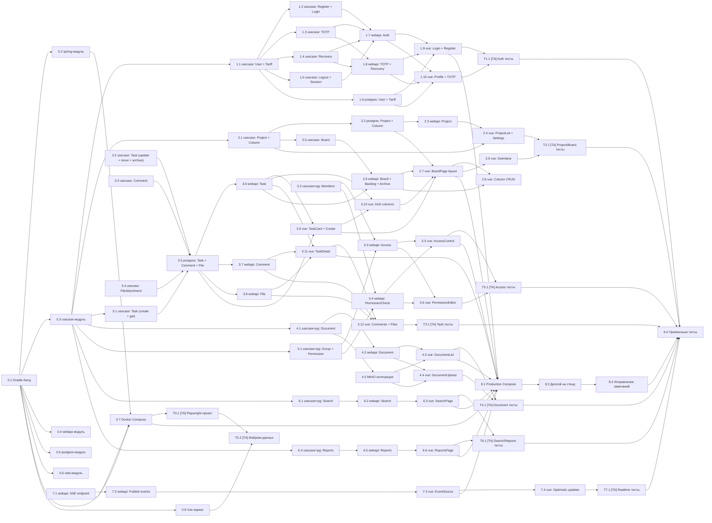
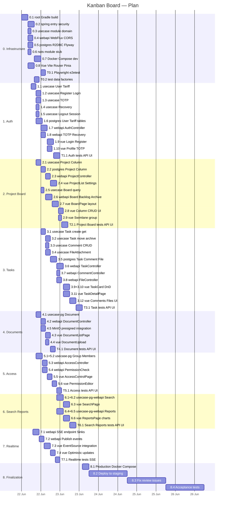

# План реализации (Implementation Plan)

## Соглашения

| Параметр | Значение |
|---|---|---|
| Разработчик | Middle-разработчик (бэкенд или фронтенд) |
| Тестировщик-автоматизатор | Middle, Playwright + TypeScript, пишет тесты параллельно с разработкой |
| Размер задачи | 2–4 часа чистой работы |
| Длительность дня | 8 часов |
| Параллельность | Бэкенд + фронтенд + тестировщик работают параллельно |
| Базовый стек | Kotlin, Spring WebFlux, R2DBC, PostgreSQL, MinIO, Vue 3, Vite, Playwright |
| Сборка | Gradle (Kotlin DSL), мультимодульный проект |

---

## Иерархический план работ (WBS)

### 0. Инфраструктура и каркас

```
0.1  Корневой Gradle-билд
0.2  Модуль spring — точка входа, Actuator, Security (JWT), Dockerfile
0.3  Модуль usecase — пустой модуль с domain-пакетами
0.4  Модуль webapi — пустой модуль, WebFlux-конфигурация, CORS
0.5  Модуль postgres — пустой модуль, R2DBC-конфигурация, Flyway
0.6  Модуль nats — пустой модуль (опциональная заглушка)
0.7  Docker Compose — postgres, minio, nginx (dev-стенд)
0.8  Vue-каркас — Vite + Router + Pinia + SCSS-темы + fetch-клиент
T0.1  [ТА] Playwright-проект (e2etest) — настройка конфига, окружения, CI-скрипта
T0.2  [ТА] Фабрики тестовых данных (генераторы пользователей, проектов, задач)
```

### 1. Идентификация и аутентификация

```
1.1  usecase: User, Tariff — сущности, value objects, порты репозитория
1.2  usecase: RegisterUser + Login + LoginWithTotp — операции
1.3  usecase: BindTotp + VerifyTotp + UnbindTotp — операции
1.4  usecase: RequestRecovery + ResetPassword — операции
1.5  usecase: Logout + GetSession + GetTariff — операции
1.6  postgres: UserTable + TariffTable + RecoveryTokenTable — реализация репозиториев
1.7  webapi: AuthController — register, login, session, tariff (+ JWT-фильтр)
1.8  webapi: TotpController + RecoveryController
1.9  vue: LoginPage, RegisterPage, auth-store
1.10 vue: ProfilePage (TOTP привязка, тариф)
T1.1  [ТА] API-тесты auth (register, login, TOTP, recover, session) + UI-тесты (LoginPage, RegisterPage)
```

### 2. Проект и доска

```
2.1  usecase: Project + Column — сущности, порты, операции
2.2  postgres: ProjectTable + ColumnTable — реализация репозиториев
2.3  webapi: ProjectController — CRUD проектов
2.4  vue: ProjectListPage + ProjectSettingsPage
2.5  usecase: Board — запрос состояния + авто-создание колонок (при создании проекта)
2.6  webapi: BoardController + BacklogController + ArchiveController
2.7  vue: BoardPage — рендер колонок, панели бэклога/архива
2.8  vue: Создание/редактирование/удаление колонок (UI)
2.9  vue: Свимлайны — frontend-only группировка по useCase
T2.1  [ТА] API-тесты project/board (CRUD, backlog, archive) + UI-тесты (BoardPage, DnD)
```

### 3. Задачи, комментарии, файлы

```
3.1  usecase: Task — сущность, CreateTask + GetTask
3.2  usecase: UpdateTask + MoveTask + ArchiveTask
3.3  usecase: Comment — сущность, CRUD-операции
3.4  usecase: FileAttachment — сущность, AttachFile + DetachFile + GetPresignedUrl
3.5  postgres: TaskTable + CommentTable + FileTable — репозитории
3.6  webapi: TaskController — CRUD + PATCH /status + POST /archive
3.7  webapi: CommentController — CRUD
3.8  webapi: FileController — upload (multipart), presigned URL, delete
3.9  vue: TaskCard (минималистичная карточка), TaskCreateForm
3.10 vue: Drag-n-drop между колонками (board logic)
3.11 vue: TaskDetailPage — полная информация, комменты, файлы
3.12 vue: CommentSystem + FileUpload UI
T3.1  [ТА] API-тесты task/comment/file + UI-тесты (TaskDetail, DnD, файлы)
```

### 4. Документы

```
4.1  usecase + postgres: Document — сущность, порт, репозиторий
4.2  webapi: DocumentController — list, get, upload, update, delete
4.3  vue: DocumentListPage (группировка по типам)
4.4  vue: DocumentUploadDialog — загрузка/замена файла
4.5  MinIO: интеграция presigned URL для документов (дополнение к задаче 3.8)
T4.1  [ТА] API-тесты document + UI-тесты (DocumentList, загрузка)
```

### 5. Управление доступом

```
5.1  usecase + postgres: Group + Permission — сущность, порт, репозиторий
5.2  usecase + postgres: Member — add/remove, проверка прав
5.3  webapi: AccessController — группы, участники, права
5.4  webapi: PermissionCheck — middleware/helper для всех контроллеров
5.5  vue: AccessControlPage — список групп, участники
5.6  vue: PermissionEditor — визуальный редактор прав
T5.1  [ТА] API-тесты access control + UI-тесты (AccessControlPage, PermissionEditor)
```

### 6. Поиск и отчёты

```
6.1  usecase + postgres: Search — full-text поиск по задачам
6.2  webapi: SearchController
6.3  vue: SearchPage — поле поиска, результаты, сниппеты, фильтры
6.4  usecase + postgres: Reports — CFD, Lead Time, Gantt, EventLog
6.5  webapi: ReportController — 4 эндпоинта
6.6  vue: ReportsPage — диаграммы (Chart.js или аналог)
T6.1  [ТА] API-тесты search/reports + UI-тесты (SearchPage, ReportsPage)
```

### 7. Real-time синхронизация (SSE)

```
7.1  webapi: SSE endpoint + Sinks.Many + буфер последних событий
7.2  webapi: Интеграция публикации событий во все мутирующие контроллеры
7.3  vue: EventSource — подключение, обработка событий, обновление store
7.4  vue: Оптимистичные обновления + обработка конфликтов (Last-Event-ID)
T7.1  [ТА] Тесты real-time (SSE-события, синхронизация между вкладками)
```

### 8. Финализация

```
8.1  Docker Compose для production (Nginx, sticky-session, healthcheck)
8.2  Деплой на стенд (1 день)
8.3  Исправление замечаний (1 день)
8.4  Приёмочные тесты (1 день)
```

---

## Граф зависимостей



---

## Диаграмма Гантта



---

## Критерии готовности (Definition of Done)

Для каждой задачи:

### Backend (usecase + postgres + webapi)
- [ ] Сущности и value objects описаны в domain-пакете
- [ ] `*Operation.kt` — интерфейс с `Arg`, `Result` (sealed class Success/Failure)
- [ ] `*OperationImpl.kt` — реализация бизнес-логики
- [ ] `*Repository.kt` — интерфейс порта вывода
- [ ] Реализация порта в `postgres`-модуле (R2DBC-таблица, репозиторий)
- [ ] `*Controller.kt` / `*Handler.kt` — эндпоинты в `webapi`
- [ ] DTO-классы для запросов/ответов
- [ ] Юнит-тесты операции (`*OperationImplTest`)
- [ ] Web-тесты контроллера (`@WebFluxTest` + `WebTestClient`)
- [ ] Error-handling: все альтернативные исходы возвращают корректный HTTP-статус
- [ ] Доступ: на endpoint есть проверка прав (где требуется)
- [ ] Код проходит `ktlint` и `detekt`

### Frontend (vue)
- [ ] Компоненты страницы написаны (Composition API, `<script setup lang="ts">`)
- [ ] Pinia store — состояние и actions
- [ ] `api.ts` — вызовы к API через `request<T>()`
- [ ] Роутинг настроен
- [ ] Обработка загрузки (loading spinner/skeleton)
- [ ] Обработка ошибок (toast/notification)
- [ ] Адаптивная вёрстка (1024×768, 1920×1080, мобильные)
- [ ] Тёмная/светлая тема
- [ ] Код проходит `eslint` + `prettier`

### Тестировщик-автоматизатор
- [ ] API-тесты покрывают happy path и основные альтернативные сценарии (WebTestClient / REST-assured)
- [ ] UI-тесты (Playwright) — key user flows: навигация, CRUD основных сущностей, DnD
- [ ] Тесты не привязаны к конкретным данным (фабрики/фикстуры)
- [ ] Тесты проходят в CI (Gradle `:e2etest:check`)
- [ ] Тесты стабильны (flake-free, retry-механизм для нестабильных E2E)

### Сквозные
- [ ] API-тест (REST → БД): эндпоинт возвращает корректный ответ для happy path
- [ ] Миграция Flyway написана и применена
- [ ] Документация OpenAPI актуальна (при изменении контракта)

---

## Проверка после деплоя (checklist для этапа 8.4)

- [ ] Регистрация нового пользователя → успех
- [ ] Вход по паролю → JWT получен
- [ ] Вход по TOTP → JWT получен
- [ ] Восстановление пароля (через email) → сброс выполнен
- [ ] Создание проекта → три колонки по умолчанию
- [ ] Редактирование/удаление проекта
- [ ] Создание/редактирование/удаление колонки
- [ ] Создание задачи → отображается в бэклоге
- [ ] Drag-n-drop задачи в колонку → статус изменён
- [ ] Сортировка задач внутри колонки
- [ ] Архивирование задачи
- [ ] Комментарии: создание, редактирование, удаление
- [ ] Прикрепление файла к задаче
- [ ] Скачивание файла (presigned URL)
- [ ] Документы: загрузка, просмотр, замена, удаление
- [ ] Создание группы, добавление пользователя
- [ ] Настройка прав → проверка ограничений
- [ ] Поиск по задачам (полнотекстовый)
- [ ] CFD-диаграмма / Lead Time / Гантт
- [ ] SSE-события: задача перемещена → обновление у второго пользователя
- [ ] Лимиты тарифа: превышение → ошибка
- [ ] Адаптивная вёрстка: 1024×768, 1920×1080, мобильный
- [ ] Тёмная тема
