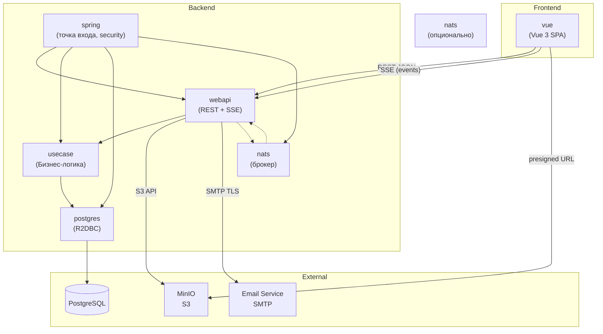

# Структура проекта

## Обзор

Мультимодульный проект. Сборщик — Gradle (Kotlin DSL). Монорепозиторий. Гексагональная архитектура: ядро (бизнес-логика) и адаптеры (ввод/вывод).

```
kanban/
├── spring/          # Точка входа, настройка Spring Boot, мониторинг, логирование
├── usecase/         # Бизнес-логика (не зависит от других модулей)
├── webapi/          # REST, SSE — адаптер ввода (HTTP)
├── postgres/        # Адаптер вывода (PostgreSQL, R2DBC)
├── nats/            # Опциональный брокер сообщений для кластеризации
├── vue/             # SPA (Vue 3 + TypeScript + Vite)
├── e2etest/         # Приёмочные тесты (Playwright — планируется)
└── docs/            # Документация
```

## Модули

### `spring`
**Точка входа** приложения (`@SpringBootApplication`). Настройка Spring Actuator (health, info, metrics, prometheus, loggers). Аутентификация (JWT), CORS, MDC-логирование. Сборка и подключение всех остальных модулей.

Структура (`src/main/kotlin/`):
- корневой пакет — `Application.kt`, настройка Actuator, Security, Logging
- `internal`-классы конфигурации

### `usecase`
**Бизнес-логика.** Ядро приложения, не зависит от других модулей проекта. Содержит:

- **Интерфейсы операций** — по одному методу, sealed-результат `Success`/`Failure`
- **Реализации операций** — бизнес-логика, не содержит кода фреймворков, БД, сетевого ввода-вывода
- **Порты** — интерфейсы, которые реализации вызывают, но не реализуют:

  | Порт | Суффикс | Назначение | Реализуется в модуле |
  |---|---|---|---|
  | поставщик/потребитель данных | `*Provider.kt` / `*Repository.kt` | Запрос/сохранение данных | `postgres` |
  | слушатель событий | `*Listener.kt` | Реакция на событие из другого домена или извне | `webapi` (SSE/NATS → usecase) |
  | публикатор событий | `*Publisher.kt` | Отправка события после выполнения операции | `webapi` (usecase → SSE), `nats` |

Все порты — только **интерфейсы** (kotlin `interface`). Реализации находятся в адаптерах (`postgres`, `webapi`, `nats`, `spring`), которые подключаются через DI (Spring).

Структура (`src/main/kotlin/`):
```
usecase/
├── identity/        # User, Session, Tariff
├── project/         # Project, Column
├── task/            # Task, Comment, FileAttachment
├── document/        # Document
├── access/          # Group, Permission
└── common/          # Общие типы, value objects
```

Каждый доменный пакет содержит:
- `*Operation.kt` — интерфейс операции (с `Arg`, `Result`)
- `*OperationImpl.kt` — реализация (внутри модуля, `internal`)
- `*Provider.kt` / `*Repository.kt` — интерфейс порта вывода (реализация в `postgres`)
- `*Listener.kt` — интерфейс порта входа (реализация в `webapi`)
- `*Publisher.kt` — интерфейс порта вывода (реализация в `webapi`/`nats`)

### `webapi`
**Адаптер ввода** (REST + SSE). Принимает HTTP-запросы, аутентифицирует, вызывает `usecase`, возвращает ответ.

Структура (`src/main/kotlin/`):
```
webapi/
├── http/            # Настройка WebFlux, глобальные exception handler
├── sse/             # SSE-эндпоинт, Sinks.Many, буфер событий
├── identity/
├── project/
├── task/
├── document/
├── access/
├── search/
├── report/
└── realtime/
```

Каждый доменный пакет содержит:
- `*Controller.kt` — один эндпоинт на файл
- `*Handler.kt` — маппинг DTO → usecase, проверка прав
- `*Request.kt` / `*Response.kt` — DTO

### `postgres`
**Адаптер вывода** к PostgreSQL. Реализует порты из `usecase`. R2DBC, миграции Flyway.

Структура (`src/main/kotlin/`):
```
postgres/
├── postgres/        # Настройка R2DBC, Flyway, конфигурация
├── identity/
├── project/
├── task/
├── document/
├── access/
└── common/          # Общие типы таблиц, BaseEntity
```

Каждый доменный пакет содержит:
- `*Table.kt` — R2DBC `@Table`, сущность БД
- `*Repository.kt` — реализация порта
- `*Generator.kt` — генератор тестовых данных

Миграции: `src/main/resources/db/migration/V*.sql`

### `nats`
**Опциональный модуль** для кластеризации. In-memory `Sinks.Many` достаточно для одного инстанса. При горизонтальном масштабировании SSE заменяется на NATS. Не влияет на контракт с фронтом (ADR 260619-0921).

### `vue`
**SPA-клиент.** Vue 3 + Composition API + TypeScript + Vite + SCSS.

Структура (`src/`):
```
vue/
├── src/
│   ├── main.ts         # Инициализация
│   ├── App.vue         # Корневой компонент (router-view + navigation)
│   ├── router.ts       # Vue Router (createWebHistory)
│   ├── pinia.ts        # Pinia store config
│   ├── fetch.ts        # API-клиент (нативный fetch, обёртка request<T>)
│   ├── style.scss      # Переменные тем (светлая/тёмная), размеров, шрифтов
│   ├── layout/         # Глобальные сетки страниц
│   ├── component/      # Глобальные компоненты
│   └── module/         # Бизнес-модули
│       ├── auth/       # (store, api, pages, components)
│       ├── project/
│       └── ...
├── nginx.conf          # Раздача статики + прокси API
├── index.html
├── vite.config.ts
└── package.json
```

Каждый бизнес-модуль может содержать:
- `*Page.vue` — страница
- `*.vue` — компоненты
- `api.ts` — вызовы API
- `store.ts` — Pinia store
- `*.ts` — бизнес-логика, изолированная от вёрстки и API

### `e2etest`
Планируемый модуль. Приёмочные тесты (Playwright + TypeScript).

## Схема взаимодействия модулей



### Зависимости модулей (Gradle)

| Модуль | Зависит от | Причина |
|---|---|---|
| `spring` | все модули | Сборка приложения |
| `webapi` | `usecase` | Вызов бизнес-логики |
| `postgres` | `usecase` | Реализация портов вывода |
| `nats` | `usecase` | Реализация порта шины событий |
| `vue` | — | Отдельный npm-проект |
| `usecase` | — | Ни от кого (ядро) |

### Поток данных

```
Браузер → REST/SSE → webapi → usecase → postgres → PostgreSQL
                            ↓
Браузер ← SSE ← webapi ← шина событий (Sinks.Many / NATS)
```

## Запуск (docker-compose)

```yaml
version: "3.9"
services:
  postgres:
    image: postgres:16-alpine
    container_name: kanban-postgres
    environment:
      POSTGRES_DB: kanban
      POSTGRES_USER: kanban
      POSTGRES_PASSWORD: "${DB_PASSWORD:?}"
    ports:
      - "5432:5432"
    volumes:
      - pgdata:/var/lib/postgresql/data
    healthcheck:
      test: ["CMD-SHELL", "pg_isready -U kanban"]
      interval: 5s
      timeout: 3s
      retries: 5

  minio:
    image: minio/minio:latest
    container_name: kanban-minio
    command: server /data --console-address ":9090"
    environment:
      MINIO_ROOT_USER: "${MINIO_ACCESS_KEY:?}"
      MINIO_ROOT_PASSWORD: "${MINIO_SECRET_KEY:?}"
    ports:
      - "9000:9000"
      - "9090:9090"
    volumes:
      - minio-data:/data
    healthcheck:
      test: ["CMD", "curl", "-f", "http://localhost:9000/minio/health/live"]
      interval: 10s
      timeout: 5s
      retries: 3

  api:
    build:
      context: .
      dockerfile: spring/Dockerfile
    container_name: kanban-api
    ports:
      - "8080:8080"
    environment:
      DB_HOST: postgres
      DB_PORT: 5432
      DB_NAME: kanban
      DB_USER: kanban
      DB_PASSWORD: "${DB_PASSWORD:?}"
      MINIO_ENDPOINT: "http://minio:9000"
      MINIO_ACCESS_KEY: "${MINIO_ACCESS_KEY:?}"
      MINIO_SECRET_KEY: "${MINIO_SECRET_KEY:?}"
      MAIL_HOST: "${MAIL_HOST}"
      MAIL_PORT: "${MAIL_PORT:-587}"
      MAIL_USERNAME: "${MAIL_USERNAME}"
      MAIL_PASSWORD: "${MAIL_PASSWORD}"
      JWT_SECRET: "${JWT_SECRET:?}"
    depends_on:
      postgres:
        condition: service_healthy
      minio:
        condition: service_healthy
    restart: unless-stopped

  front:
    build:
      context: vue
      dockerfile: Dockerfile
    container_name: kanban-front
    ports:
      - "80:80"
    depends_on:
      - api
    restart: unless-stopped

volumes:
  pgdata:
  minio-data:
```

### Переменные окружения

| Переменная | Назначение | Пример (dev) |
|---|---|---|
| `DB_PASSWORD` | Пароль PostgreSQL | `kanban` |
| `MINIO_ACCESS_KEY` | Access key MinIO | `minioadmin` |
| `MINIO_SECRET_KEY` | Secret key MinIO | `minioadmin` |
| `JWT_SECRET` | Секрет подписи JWT | `dev-secret-32-chars-min!!` |
| `MAIL_HOST` | SMTP-хост | `smtp.example.com` |
| `MAIL_USERNAME` | SMTP-пользователь | `noreply@example.com` |
| `MAIL_PASSWORD` | SMTP-пароль | — |

### Запуск

```bash
# Сборка и запуск всех сервисов
export DB_PASSWORD=kanban
export MINIO_ACCESS_KEY=minioadmin
export MINIO_SECRET_KEY=minioadmin
export JWT_SECRET=dev-secret-32-chars-min!!
docker compose up --build

# Отдельные сервисы
docker compose up -d postgres minio   # Только инфраструктура
docker compose up api                 # Backend
docker compose up front               # Frontend
```

### URL

| Сервис | URL |
|---|---|
| Frontend | `http://localhost` |
| Backend API | `http://localhost:8080` |
| MinIO Console | `http://localhost:9090` |
| PostgreSQL | `localhost:5432` |
