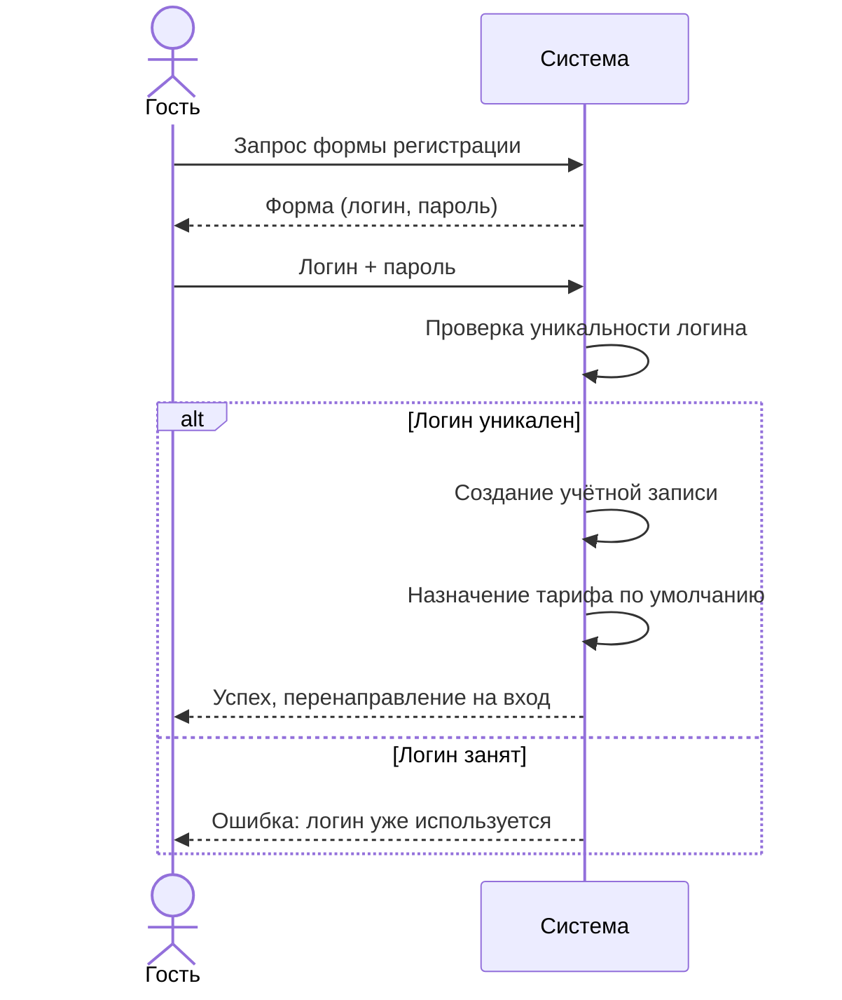
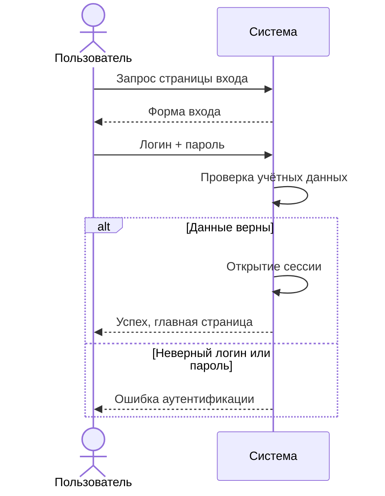
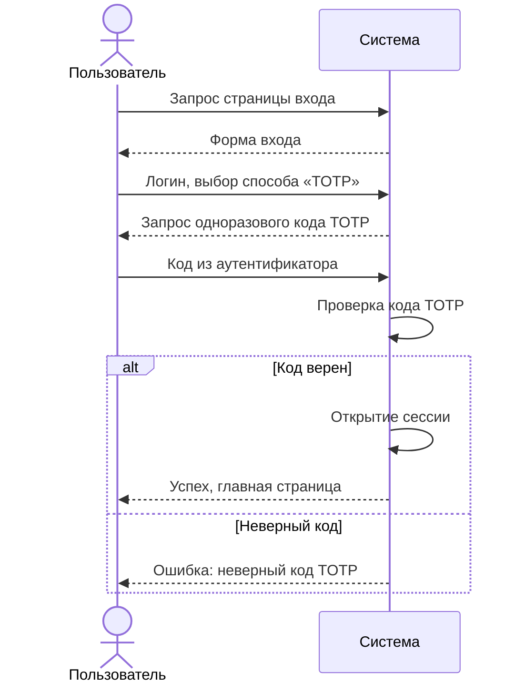
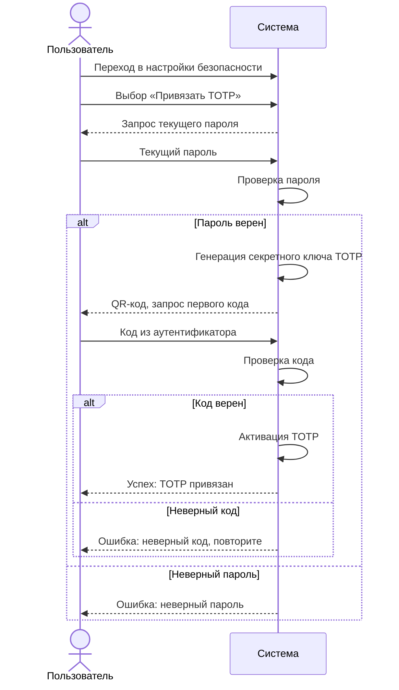
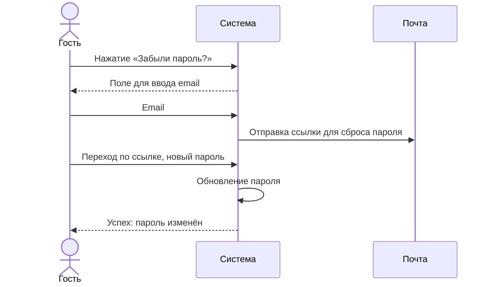
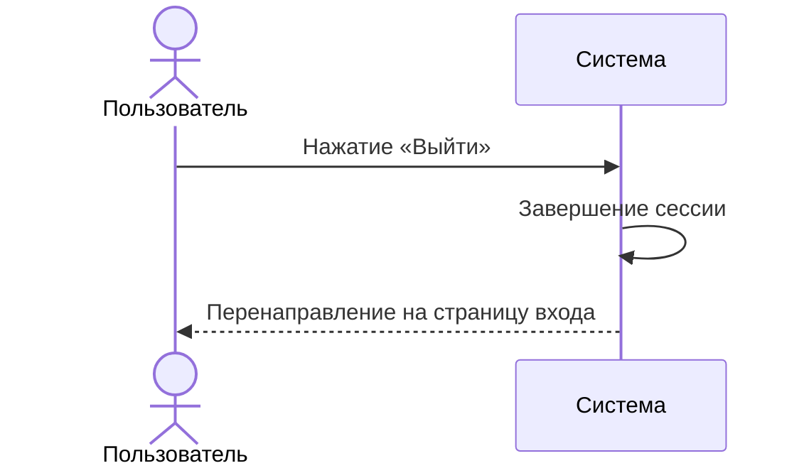
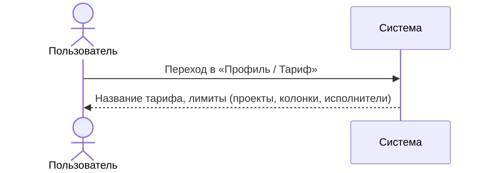

# Сценарии использования: Аутентификация и профиль

---

## UC-01-01: Регистрация нового пользователя
**Актор:** Гость  
**Цель:** Создать учётную запись  
**Предусловия:** Гость не аутентифицирован  
**Постусловия:** Создана учётная запись, назначен тариф по умолчанию  

**Связанный сценарий:** [US-01-01](../userstory/01-auth-and-profile.md#us-01-01)

---

## UC-01-02: Вход по логину и паролю
**Актор:** Зарегистрированный пользователь  
**Цель:** Аутентифицироваться в системе  
**Предусловия:** Учётная запись существует  
**Постусловия:** Открыта пользовательская сессия  

**Связанный сценарий:** [US-01-02](../userstory/01-auth-and-profile.md#us-01-02)

---

## UC-01-03: Вход с TOTP вместо пароля
**Актор:** Зарегистрированный пользователь с привязанным TOTP  
**Цель:** Аутентифицироваться с помощью TOTP  
**Предусловия:** Учётная запись существует, TOTP привязан  
**Постусловия:** Открыта пользовательская сессия  

**Связанный сценарий:** [US-01-03](../userstory/01-auth-and-profile.md#us-01-03)

---

## UC-01-04: Привязка TOTP-аутентификатора
**Актор:** Зарегистрированный пользователь  
**Цель:** Настроить вход по TOTP без пароля  
**Предусловия:** Пользователь аутентифицирован, TOTP ещё не привязан  
**Постусловия:** TOTP привязан, теперь доступен вход по логину + коду  

**Связанный сценарий:** [US-01-04](../userstory/01-auth-and-profile.md#us-01-04)

---

## UC-01-05: Восстановление доступа по почте
**Актор:** Гость (забывший пароль)  
**Цель:** Восстановить доступ к учётной записи  
**Предусловия:** Учётная запись существует, указана почта  
**Постусловия:** Пароль сброшен  

**Связанный сценарий:** [US-01-05](../userstory/01-auth-and-profile.md#us-01-05)

---

## UC-01-06: Выход из системы
**Актор:** Аутентифицированный пользователь  
**Цель:** Завершить сессию  
**Предусловия:** Пользователь аутентифицирован  
**Постусловия:** Сессия завершена  

**Связанный сценарий:** [US-01-06](../userstory/01-auth-and-profile.md#us-01-06)

---

## UC-01-07: Просмотр тарифного плана
**Актор:** Аутентифицированный пользователь  
**Цель:** Узнать текущий тариф и его лимиты  
**Предусловия:** Пользователь аутентифицирован  
**Постусловия:** Отображена информация о тарифе  

**Связанный сценарий:** [US-01-07](../userstory/01-auth-and-profile.md#us-01-07)
