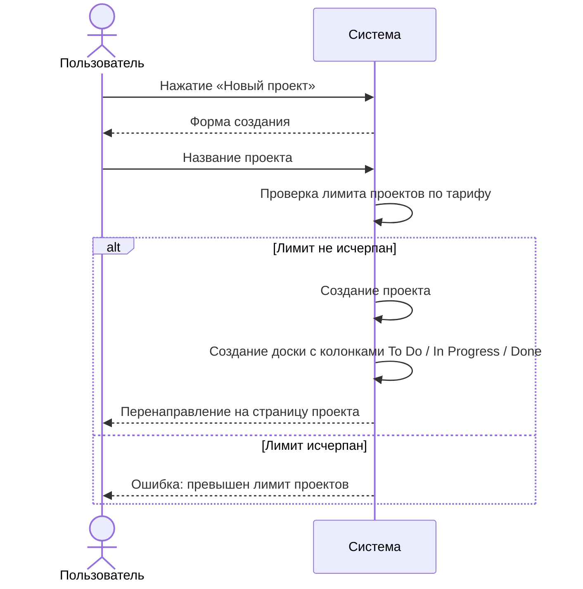
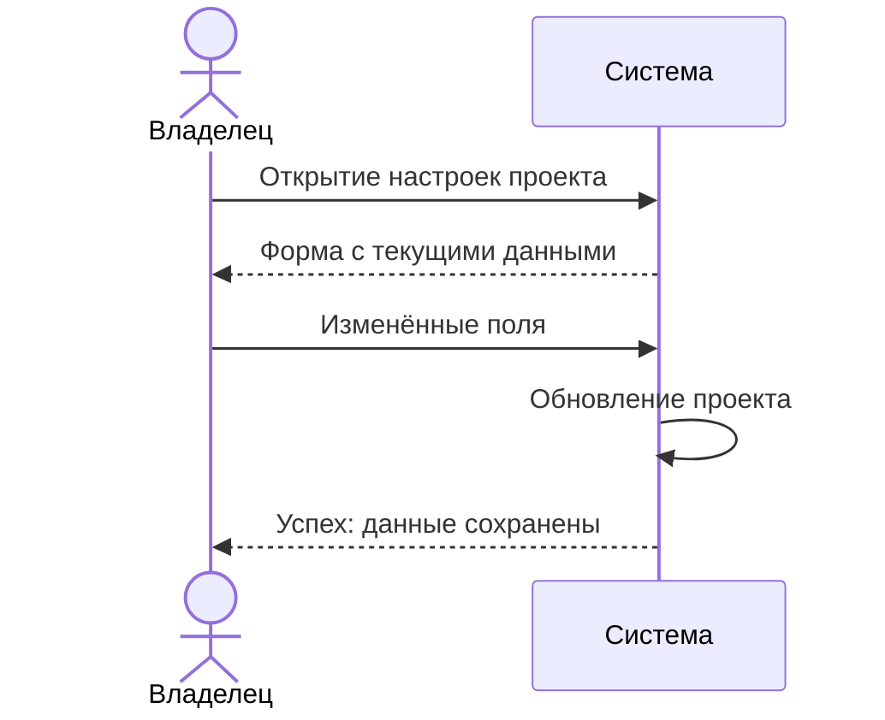
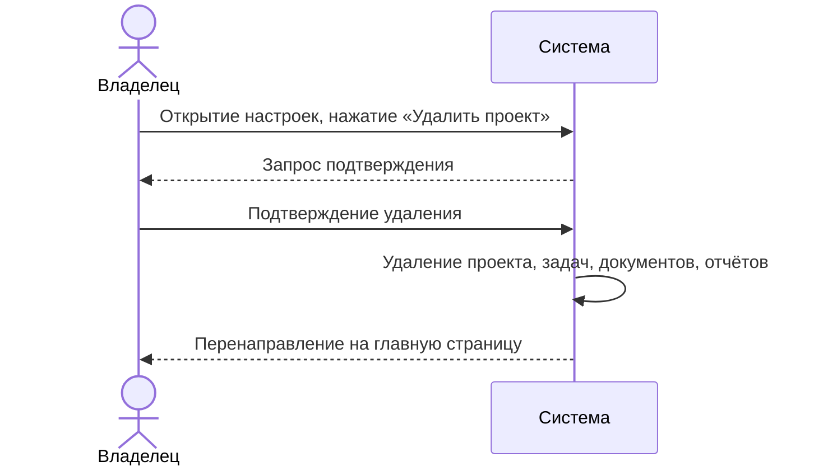

# Сценарии использования: Управление проектами

---

## UC-02-01: Создание проекта
**Актор:** Аутентифицированный пользователь  
**Цель:** Создать новый проект с канбан-доской  
**Предусловия:** Пользователь аутентифицирован, лимит проектов по тарифу не исчерпан  
**Постусловия:** Создан проект с доской, три колонки по умолчанию  

**Связанный сценарий:** [US-02-01](../userstory/02-project-management.md#us-02-01)

---

## UC-02-02: Редактирование проекта
**Актор:** Владелец проекта  
**Цель:** Изменить название или описание проекта  
**Предусловия:** Проект существует, пользователь — владелец  
**Постусловия:** Данные проекта обновлены  

**Связанный сценарий:** [US-02-02](../userstory/02-project-management.md#us-02-02)

---

## UC-02-03: Удаление проекта
**Актор:** Владелец проекта  
**Цель:** Безвозвратно удалить проект  
**Предусловия:** Проект существует, пользователь — владелец  
**Постусловия:** Проект и все связанные данные удалены  

**Связанный сценарий:** [US-02-03](../userstory/02-project-management.md#us-02-03)
