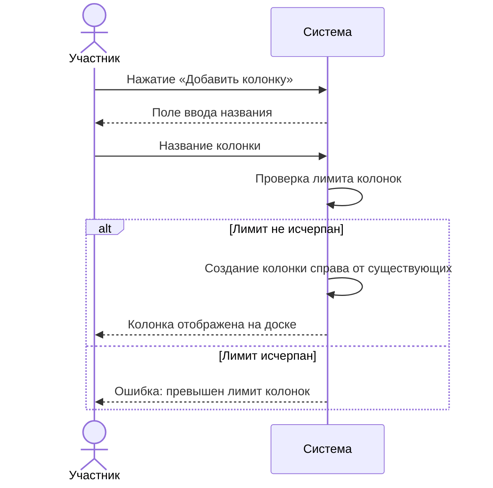
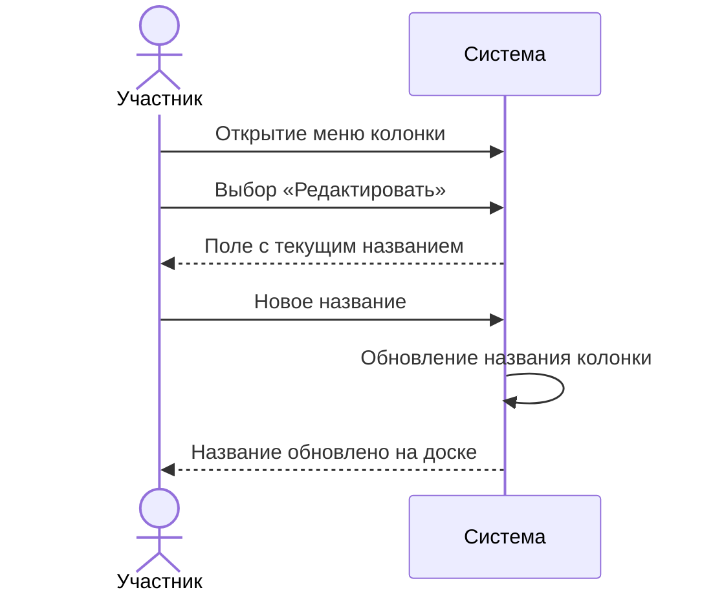
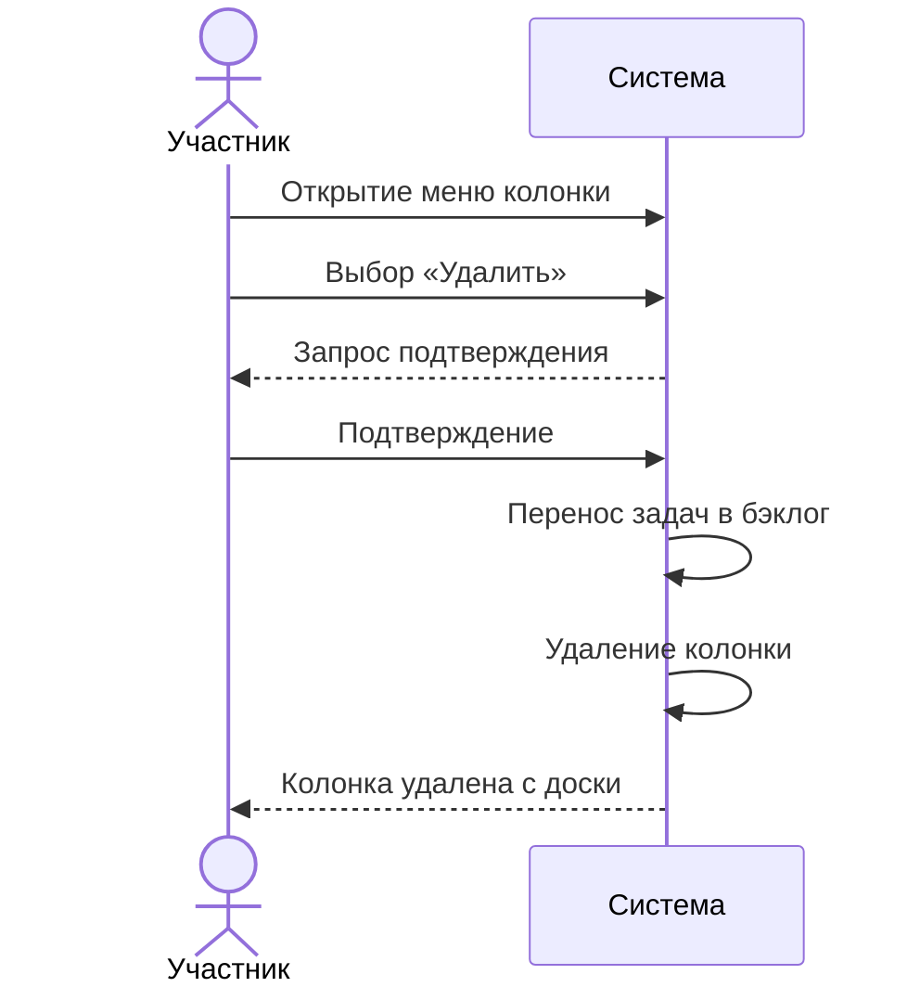
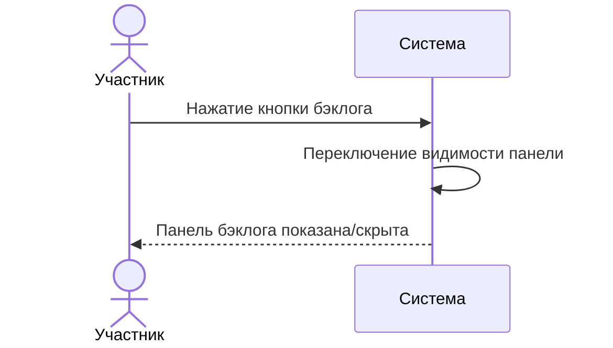
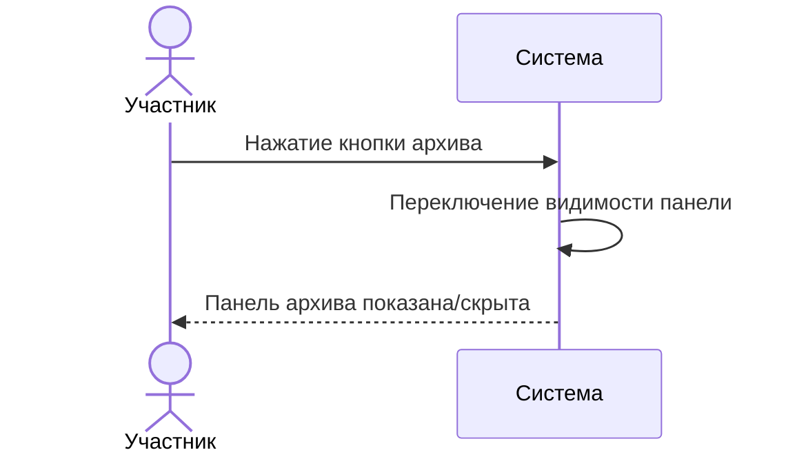
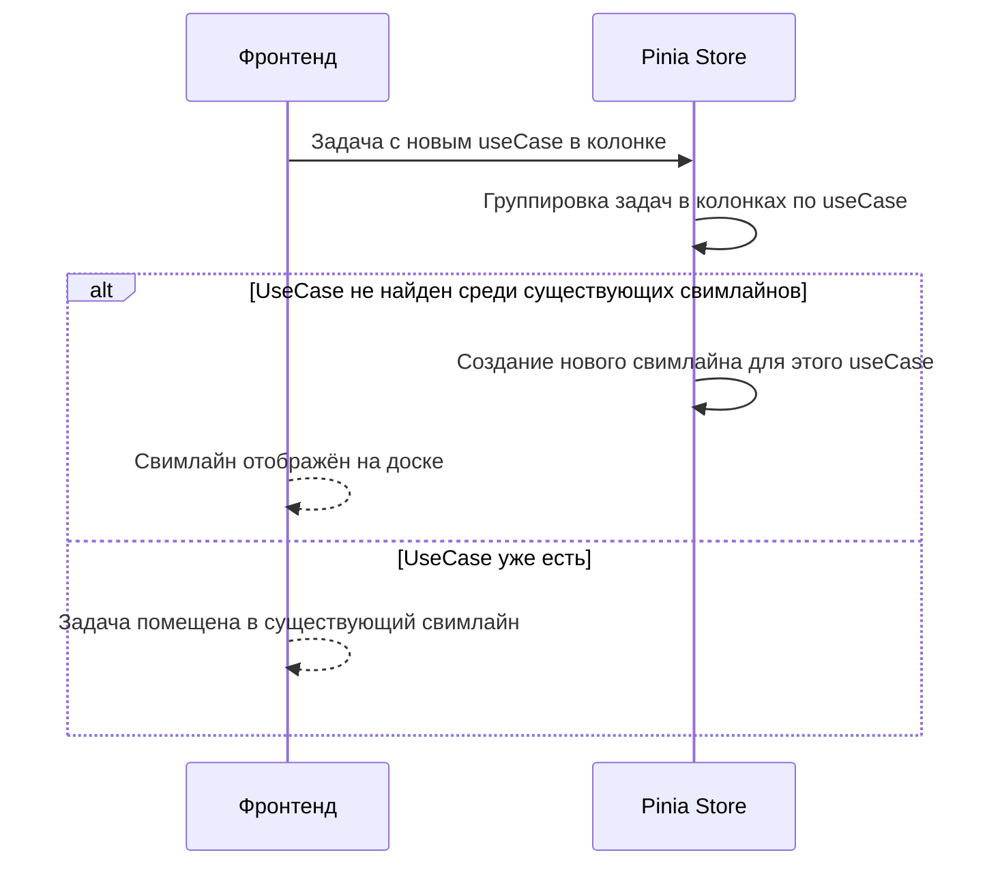
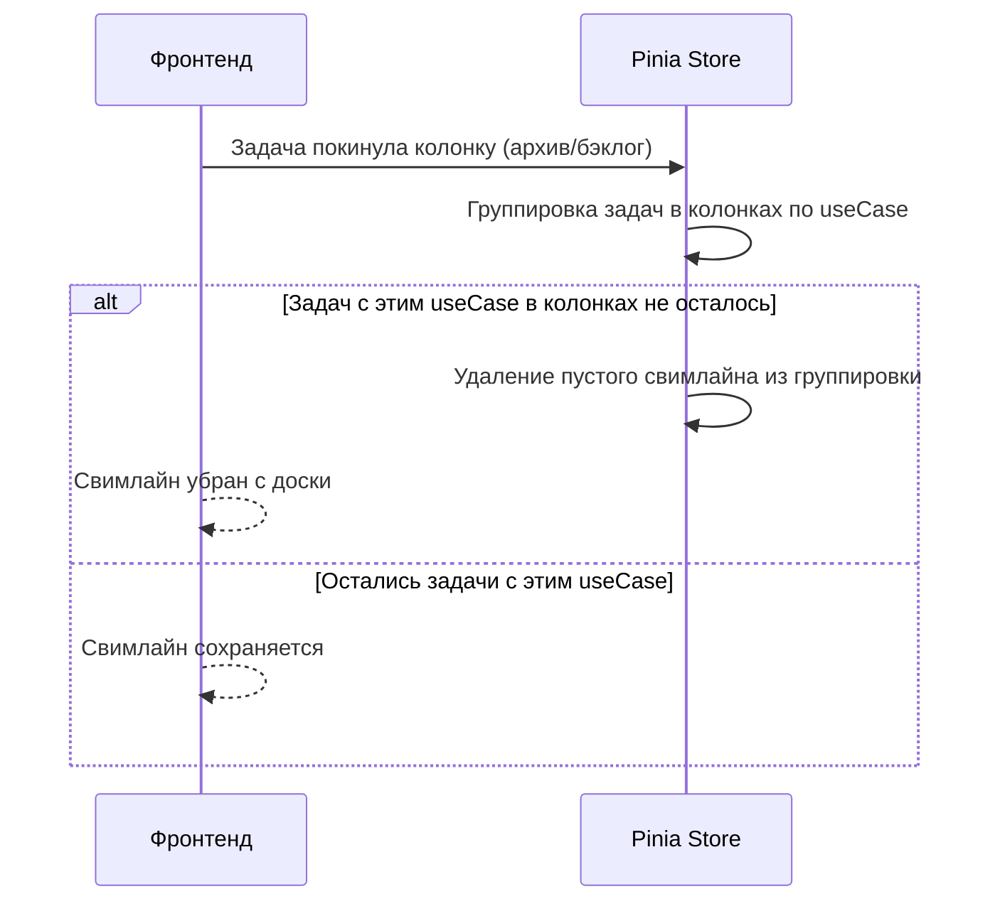

# Сценарии использования: Колонки и свимлайны

---

## UC-03-01: Создание колонки
**Актор:** Участник проекта с правом редактирования  
**Цель:** Добавить новую колонку статуса на доску  
**Предусловия:** Пользователь имеет права на редактирование доски, лимит колонок не исчерпан  
**Постусловия:** Создана новая пустая колонка  

**Связанный сценарий:** [US-03-01](../userstory/03-board-columns-and-swimlanes.md#us-03-01)

---

## UC-03-02: Редактирование колонки
**Актор:** Участник проекта с правом редактирования  
**Цель:** Переименовать колонку  
**Предусловия:** Колонка существует  
**Постусловия:** Название колонки обновлено  

**Связанный сценарий:** [US-03-02](../userstory/03-board-columns-and-swimlanes.md#us-03-02)

---

## UC-03-03: Удаление колонки
**Актор:** Участник проекта с правом редактирования  
**Цель:** Удалить колонку  
**Предусловия:** Колонка существует  
**Постусловия:** Колонка удалена, задачи перенесены в бэклог  

**Связанный сценарий:** [US-03-03](../userstory/03-board-columns-and-swimlanes.md#us-03-03)

---

## UC-03-04: Открытие/скрытие бэклога
**Актор:** Участник проекта  
**Цель:** Показать или скрыть панель бэклога  
**Предусловия:** Доска проекта открыта  
**Постусловия:** Панель бэклога отображена или скрыта  

**Связанный сценарий:** [US-03-04](../userstory/03-board-columns-and-swimlanes.md#us-03-04)

---

## UC-03-05: Открытие/скрытие архива
**Актор:** Участник проекта  
**Цель:** Показать или скрыть панель архива  
**Предусловия:** Доска проекта открыта  
**Постусловия:** Панель архива отображена или скрыта  

**Связанный сценарий:** [US-03-05](../userstory/03-board-columns-and-swimlanes.md#us-03-05)

---

## UC-03-06: Автоматическое появление свимлайна (frontend-only)
**Актор:** Фронтенд (клиент)  
**Цель:** Отобразить новый свимлайн при появлении задачи с новым Use Case  
**Предусловия:** Задача с новым Use Case появилась в колонке (после перемещения из бэклога или создания)  
**Постусловия:** Свимлайн отображён на доске  

**Связанный сценарий:** [US-03-06](../userstory/03-board-columns-and-swimlanes.md#us-03-06)

---

## UC-03-07: Автоматическое удаление свимлайна (frontend-only)
**Актор:** Фронтенд (клиент)  
**Цель:** Убрать свимлайн, когда в колонках не осталось задач с его Use Case  
**Предусловия:** Существует свимлайн с задачами  
**Постусловия:** Пустой свимлайн убран с доски  

**Связанный сценарий:** [US-03-07](../userstory/03-board-columns-and-swimlanes.md#us-03-07)
