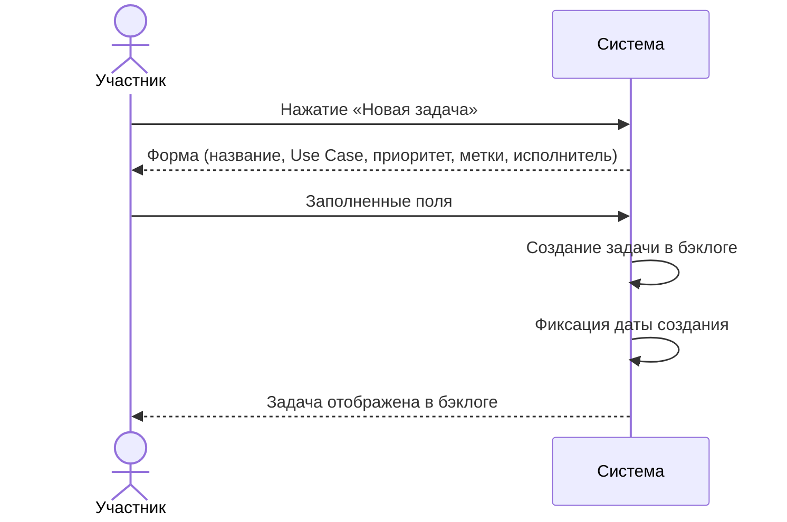
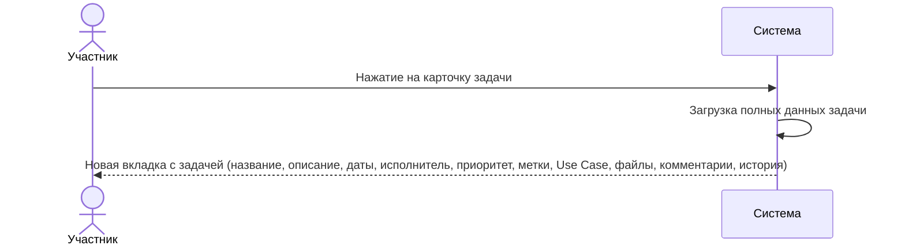
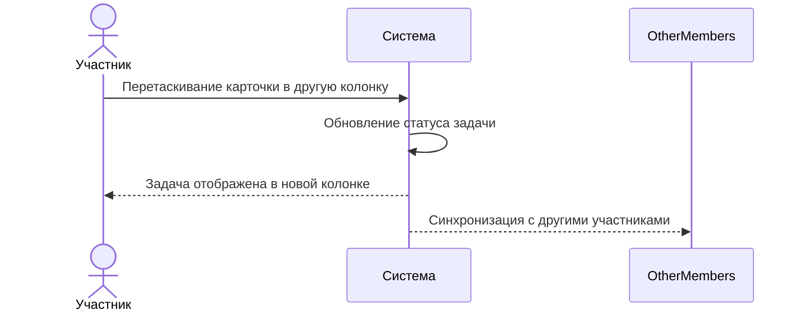
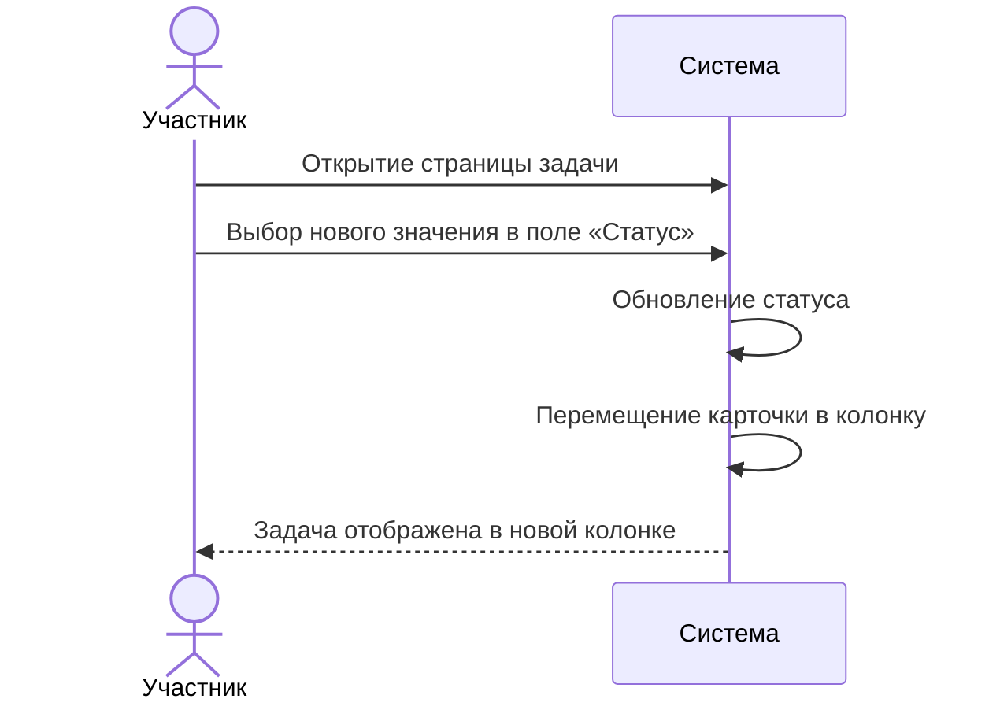
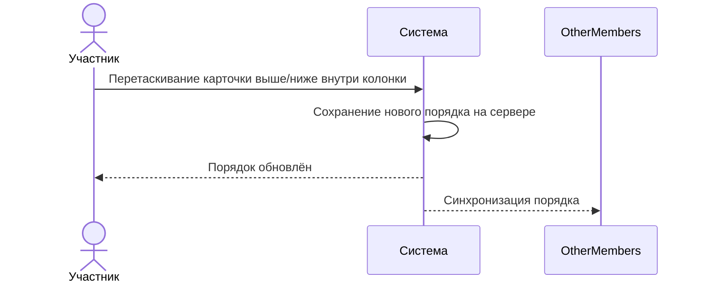
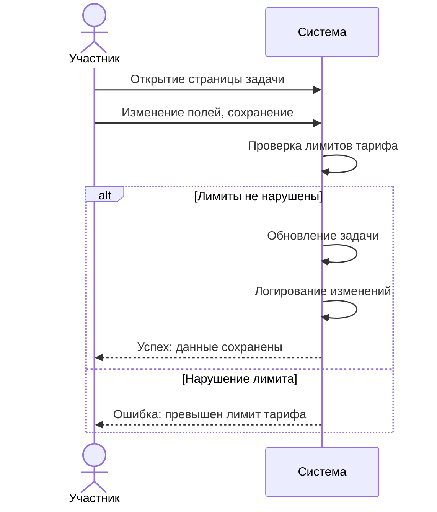
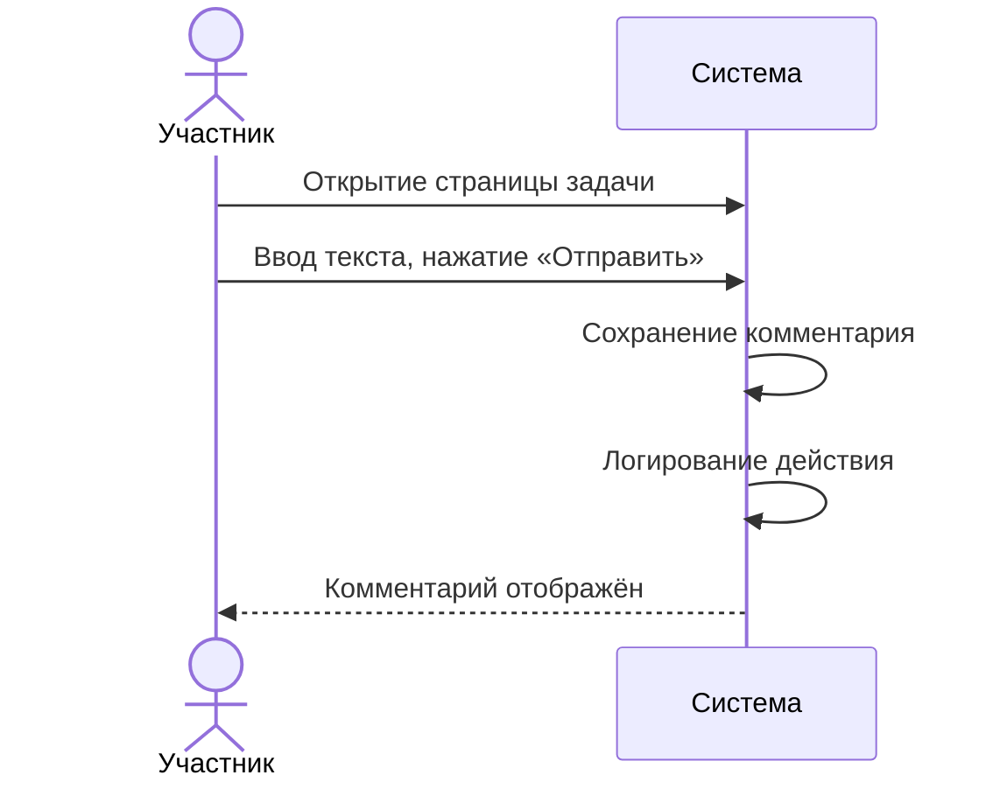
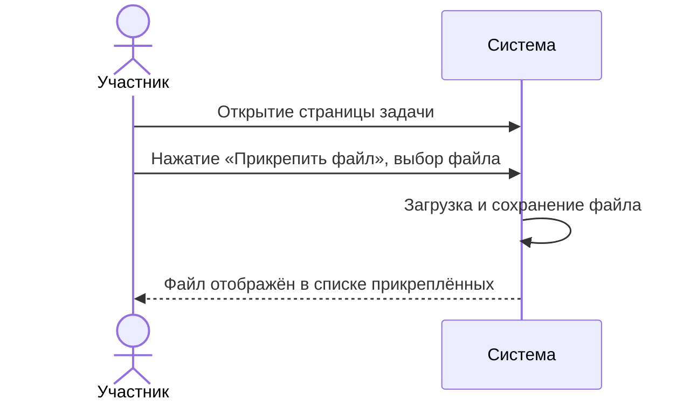
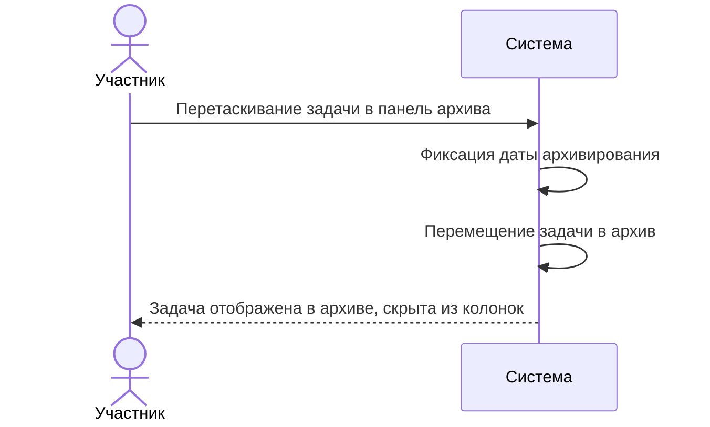
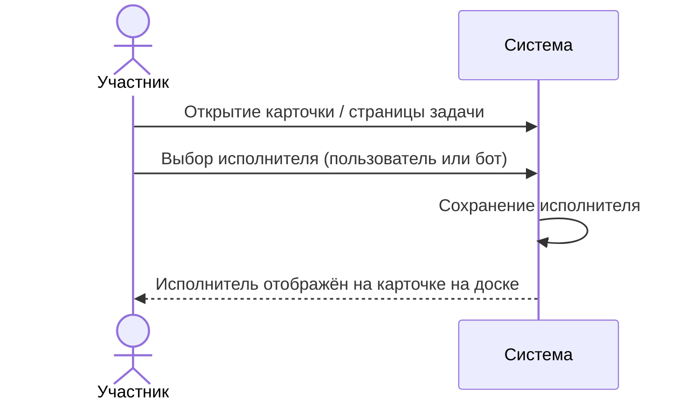

# Сценарии использования: Операции с задачами

---

## UC-04-01: Создание задачи
**Актор:** Участник проекта  
**Цель:** Добавить новую задачу в проект  
**Предусловия:** Пользователь имеет права на создание задач  
**Постусловия:** Задача создана и помещена в бэклог  

**Связанный сценарий:** [US-04-01](../userstory/04-task-operations.md#us-04-01)

---

## UC-04-02: Просмотр полной информации о задаче
**Актор:** Участник проекта  
**Цель:** Увидеть все детали задачи  
**Предусловия:** Задача существует  
**Постусловия:** Открыта страница задачи  

**Связанный сценарий:** [US-04-02](../userstory/04-task-operations.md#us-04-02)

---

## UC-04-03: Перемещение задачи между колонками (drag-n-drop)
**Актор:** Участник проекта  
**Цель:** Изменить статус задачи перетаскиванием  
**Предусловия:** Задача в колонке  
**Постусловия:** Статус задачи изменён, позиция сохранена  

**Связанный сценарий:** [US-04-03](../userstory/04-task-operations.md#us-04-03)

---

## UC-04-04: Перемещение задачи через изменение статуса
**Актор:** Участник проекта  
**Цель:** Изменить статус задачи без drag-n-drop  
**Предусловия:** Задача существует  
**Постусловия:** Статус задачи изменён  

**Связанный сценарий:** [US-04-04](../userstory/04-task-operations.md#us-04-04)

---

## UC-04-05: Сортировка задач в колонке (drag-n-drop)
**Актор:** Участник проекта  
**Цель:** Изменить порядок задач в колонке  
**Предусловия:** В колонке есть задачи  
**Постусловия:** Порядок задач изменён и сохранён на сервере  

**Связанный сценарий:** [US-04-05](../userstory/04-task-operations.md#us-04-05)

---

## UC-04-06: Редактирование задачи
**Актор:** Участник проекта  
**Цель:** Изменить поля задачи  
**Предусловия:** Задача существует  
**Постусловия:** Поля задачи обновлены, изменения залогированы  

**Связанный сценарий:** [US-04-06](../userstory/04-task-operations.md#us-04-06)

---

## UC-04-07: Добавление комментария к задаче
**Актор:** Участник проекта  
**Цель:** Оставить текстовый комментарий  
**Предусловия:** Задача существует  
**Постусловия:** Комментарий сохранён  

**Связанный сценарий:** [US-04-07](../userstory/04-task-operations.md#us-04-07)

---

## UC-04-08: Прикрепление файла к задаче
**Актор:** Участник проекта  
**Цель:** Прикрепить файл к задаче  
**Предусловия:** Задача существует  
**Постусловия:** Файл загружен и привязан к задаче  

**Связанный сценарий:** [US-04-08](../userstory/04-task-operations.md#us-04-08)

---

## UC-04-09: Архивирование задачи
**Актор:** Участник проекта  
**Цель:** Переместить задачу в архив  
**Предусловия:** Задача находится в колонке  
**Постусловия:** Задача перемещена в архив, зафиксирована дата архивирования  

**Связанный сценарий:** [US-04-09](../userstory/04-task-operations.md#us-04-09)

---

## UC-04-10: Назначение исполнителя
**Актор:** Участник проекта  
**Цель:** Назначить ответственного за задачу  
**Предусловия:** Задача существует  
**Постусловия:** Исполнитель назначен  

**Связанный сценарий:** [US-04-10](../userstory/04-task-operations.md#us-04-10)
