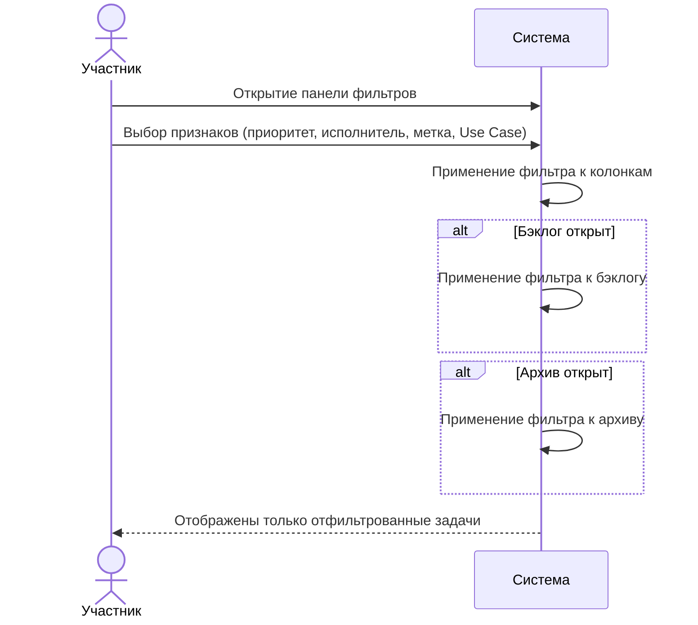
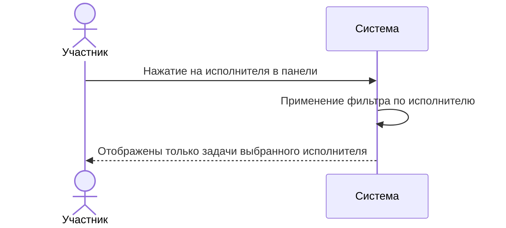
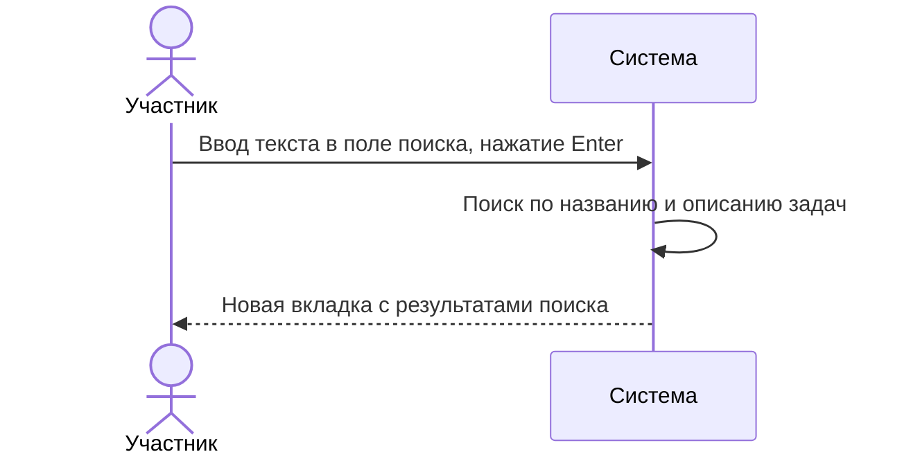
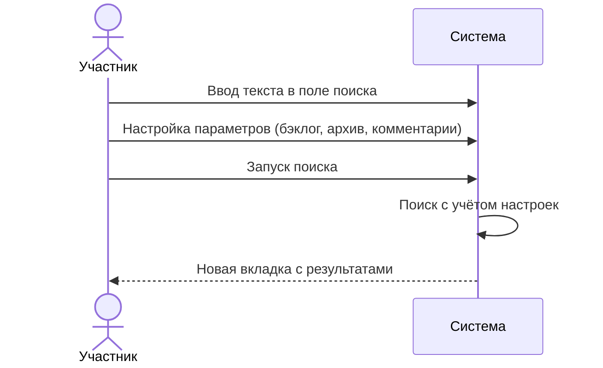

# Сценарии использования: Фильтрация и поиск

---

## UC-05-01: Фильтрация задач по признаку
**Актор:** Участник проекта  
**Цель:** Отобразить только задачи, соответствующие выбранным признакам  
**Предусловия:** Доска проекта открыта  
**Постусловия:** На доске отображены только задачи, удовлетворяющие фильтру  

**Связанный сценарий:** [US-05-01](../userstory/05-filtering-and-search.md#us-05-01)

---

## UC-05-02: Фильтр по исполнителю через панель исполнителей
**Актор:** Участник проекта  
**Цель:** Увидеть задачи конкретного исполнителя  
**Предусловия:** Панель исполнителей открыта  
**Постусловия:** Фильтр по выбранному исполнителю активен  

**Связанный сценарий:** [US-05-02](../userstory/05-filtering-and-search.md#us-05-02)

---

## UC-05-03: Поиск по задачам
**Актор:** Участник проекта  
**Цель:** Найти задачи по тексту в названии или описании  
**Предусловия:** Доска проекта открыта  
**Постусловия:** Открыта вкладка с результатами поиска  

**Связанный сценарий:** [US-05-03](../userstory/05-filtering-and-search.md#us-05-03)

---

## UC-05-04: Расширенный поиск с настройками
**Актор:** Участник проекта  
**Цель:** Найти задачи с точной настройкой области поиска  
**Предусловия:** Доска проекта открыта  
**Постусловия:** Открыта вкладка с отфильтрованными результатами  

**Связанный сценарий:** [US-05-04](../userstory/05-filtering-and-search.md#us-05-04)
