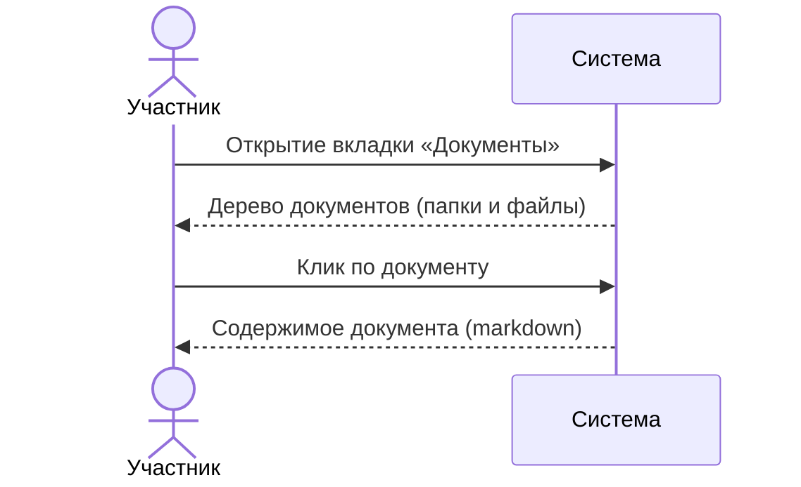
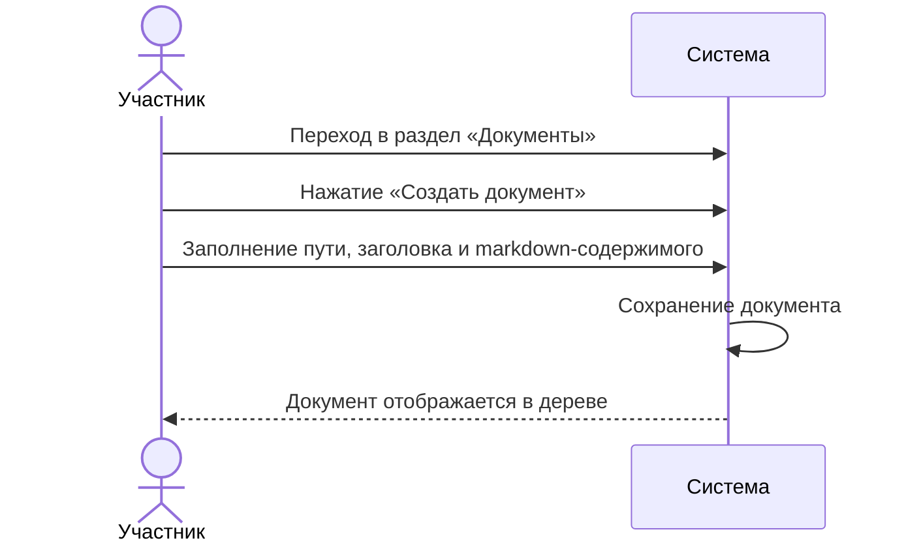

# Сценарии использования: Документы проекта

---

## UC-06-01: Просмотр списка документов проекта
**Актор:** Участник проекта  
**Цель:** Увидеть все документы, связанные с проектом  
**Предусловия:** Проект существует, пользователь имеет доступ  
**Постусловия:** Отображён список документов в виде иерархического дерева

**Связанный сценарий:** [US-06-01](../userstory/06-documents.md#us-06-01)

---

## UC-06-02: Создание/редактирование документа
**Актор:** Участник проекта с правом редактирования  
**Цель:** Добавить или изменить документ проекта  
**Предусловия:** Проект существует, пользователь имеет права на редактирование  
**Постусловия:** Документ сохранён и доступен участникам проекта

**Связанный сценарий:** [US-06-02](../userstory/06-documents.md#us-06-02)
