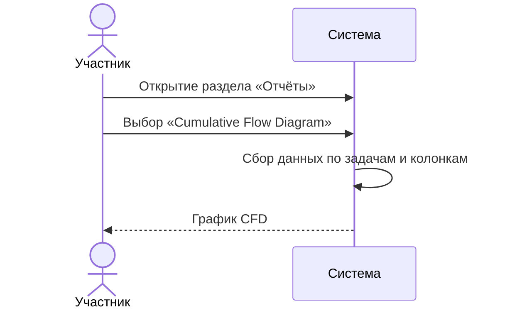
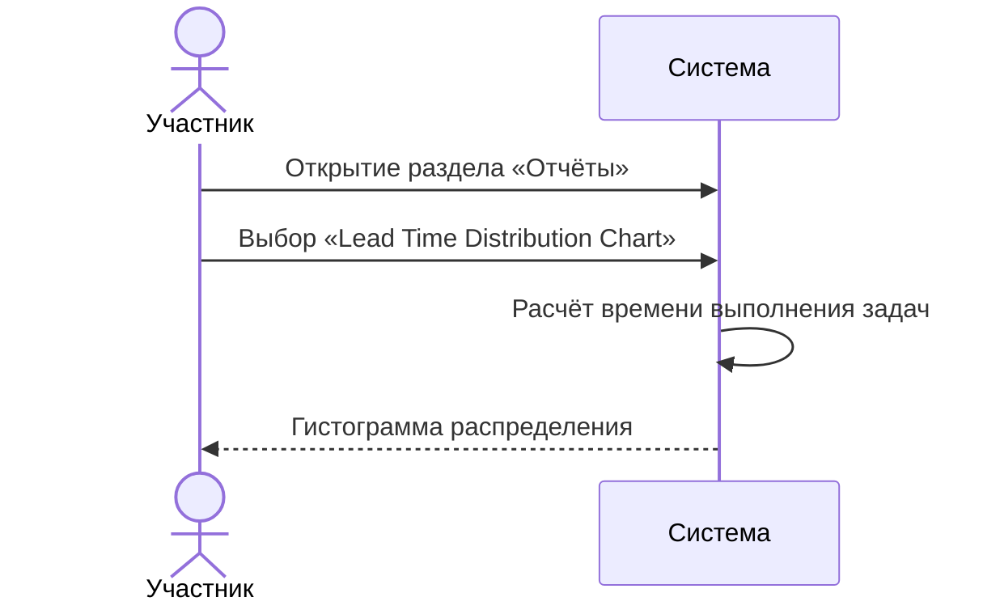
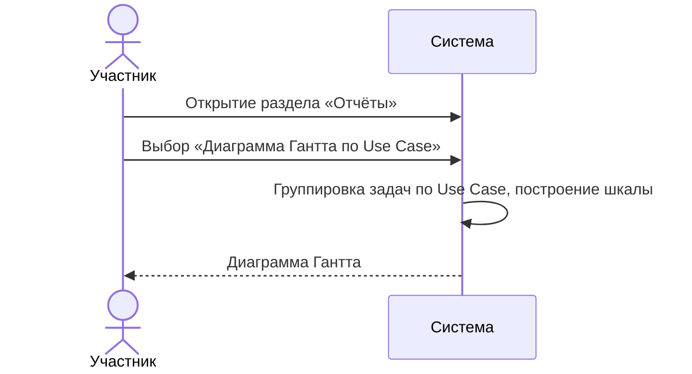
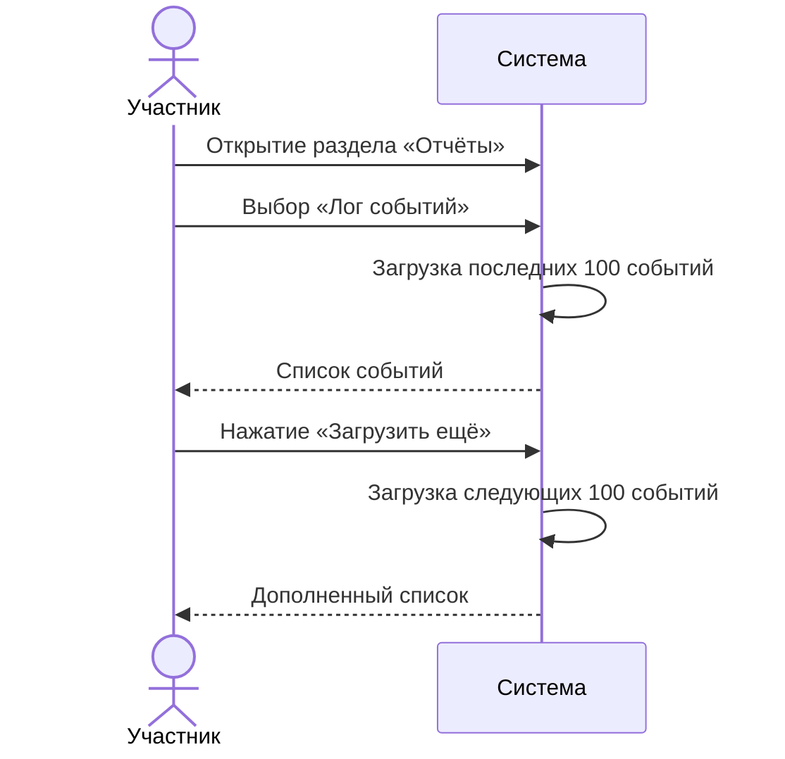

# Сценарии использования: Отчёты

---

## UC-07-01: Просмотр Cumulative Flow Diagram
**Актор:** Участник проекта  
**Цель:** Проанализировать динамику накопления задач по колонкам  
**Предусловия:** На доске есть достаточно данных для построения графика  
**Постусловия:** Отображён график CFD  

**Связанный сценарий:** [US-07-01](../userstory/07-reports.md#us-07-01)

---

## UC-07-02: Просмотр Lead Time Distribution Chart
**Актор:** Участник проекта  
**Цель:** Проанализировать распределение времени выполнения задач  
**Предусловия:** Есть завершённые задачи  
**Постусловия:** Отображена гистограмма  

**Связанный сценарий:** [US-07-02](../userstory/07-reports.md#us-07-02)

---

## UC-07-03: Просмотр диаграммы Гантта по Use Case
**Актор:** Участник проекта  
**Цель:** Увидеть временную шкалу задач, сгруппированных по Use Case  
**Предусловия:** Есть задачи с назначенным Use Case  
**Постусловия:** Отображена диаграмма Гантта  

**Связанный сценарий:** [US-07-03](../userstory/07-reports.md#us-07-03)

---

## UC-07-04: Просмотр лога событий
**Актор:** Участник проекта  
**Цель:** Просмотреть историю изменений на доске  
**Предусловия:** Есть залогированные события  
**Постусловия:** Отображена страница лога  

**Связанный сценарий:** [US-07-04](../userstory/07-reports.md#us-07-04)
