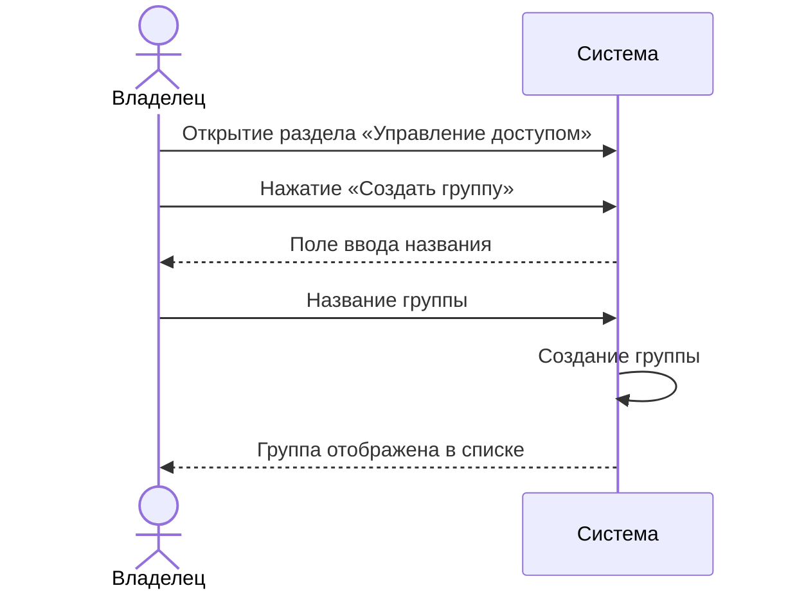
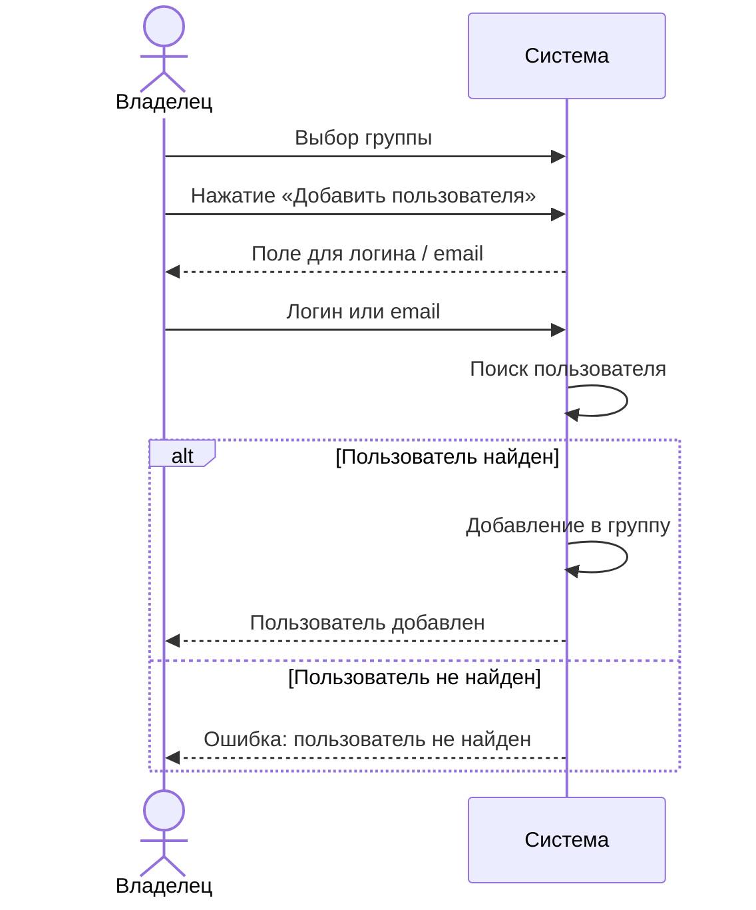
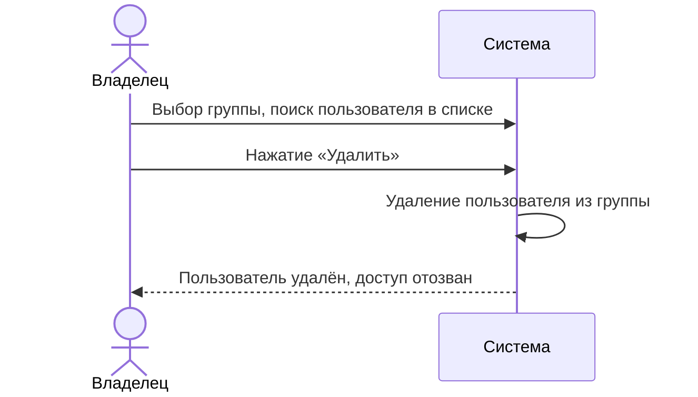
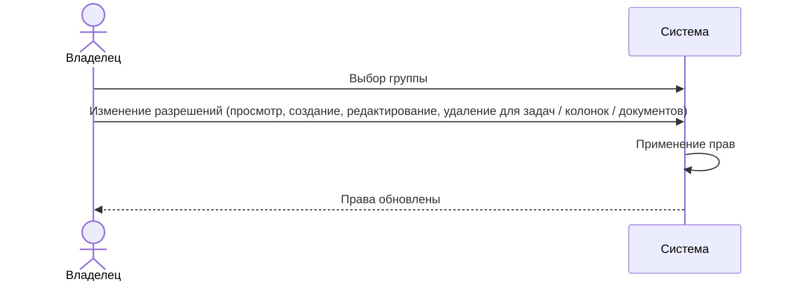

# Сценарии использования: Управление доступом

---

## UC-08-01: Создание группы пользователей
**Актор:** Владелец проекта  
**Цель:** Создать новую группу для разграничения прав доступа  
**Предусловия:** Проект существует  
**Постусловия:** Создана пустая группа  

**Связанный сценарий:** [US-08-01](../userstory/08-access-control.md#us-08-01)

---

## UC-08-02: Добавление пользователя в группу
**Актор:** Владелец проекта  
**Цель:** Дать пользователю доступ к проекту  
**Предусловия:** Группа существует  
**Постусловия:** Пользователь добавлен в группу  

**Связанный сценарий:** [US-08-02](../userstory/08-access-control.md#us-08-02)

---

## UC-08-03: Удаление пользователя из группы
**Актор:** Владелец проекта  
**Цель:** Отозвать доступ пользователя к проекту  
**Предусловия:** Пользователь состоит в группе  
**Постусловия:** Пользователь удалён из группы  

**Связанный сценарий:** [US-08-03](../userstory/08-access-control.md#us-08-03)

---

## UC-08-04: Настройка прав доступа группы
**Актор:** Владелец проекта  
**Цель:** Определить, какие действия участники группы могут выполнять  
**Предусловия:** Группа существует  
**Постусловия:** Права группы обновлены  

**Связанный сценарий:** [US-08-04](../userstory/08-access-control.md#us-08-04)
