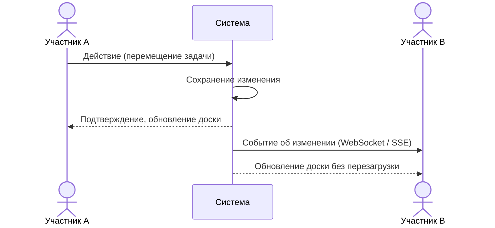
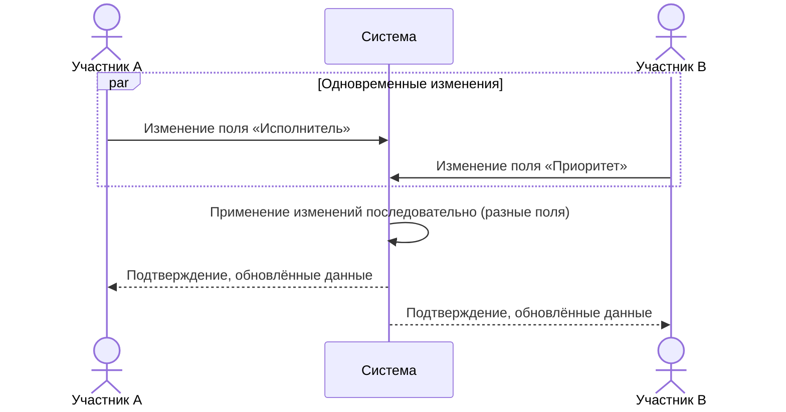

# Сценарии использования: Совместная работа в реальном времени

---

## UC-09-01: Синхронизация изменений между участниками
**Актор:** Два участника проекта  
**Цель:** Видеть изменения друг друга без перезагрузки  
**Предусловия:** Оба участника открыли одну доску  
**Постусловия:** Изменения одного участника отображены у другого  

**Связанный сценарий:** [US-09-01](../userstory/09-realtime.md#us-09-01)

---

## UC-09-02: Обработка конкурирующих изменений
**Актор:** Два участника, одновременно редактирующих одну задачу  
**Цель:** Не потерять ни одно из изменений  
**Предусловия:** Оба участника открыли страницу одной задачи  
**Постусловия:** Оба изменения применены  

**Связанный сценарий:** [US-09-02](../userstory/09-realtime.md#us-09-02)
