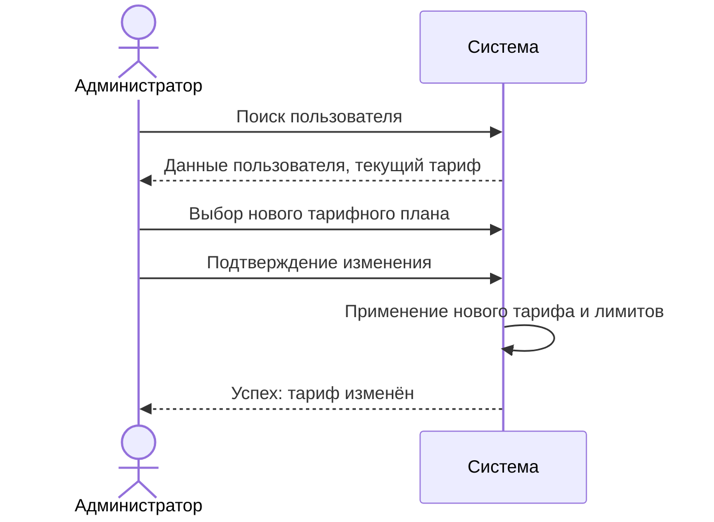
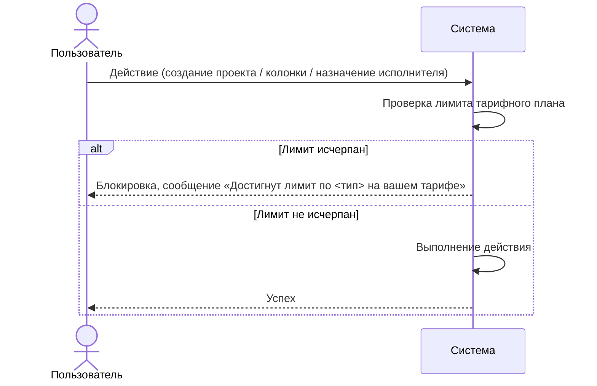

# Сценарии использования: Администрирование

---

## UC-10-01: Изменение тарифного плана пользователя
**Актор:** Системный пользователь (администратор)  
**Цель:** Изменить тарифный план учётной записи  
**Предусловия:** Целевая учётная запись существует  
**Постусловия:** Тарифный план изменён, новые лимиты активны  

**Связанный сценарий:** [US-10-01](../userstory/10-admin.md#us-10-01)

---

## UC-10-02: Уведомление о превышении лимита тарифа
**Актор:** Система  
**Цель:** Сообщить пользователю о достижении лимита  
**Предусловия:** Пользователь пытается выполнить действие, превышающее лимит тарифа  
**Постусловия:** Действие заблокировано, отображено сообщение  

**Связанный сценарий:** [US-10-02](../userstory/10-admin.md#us-10-02)
