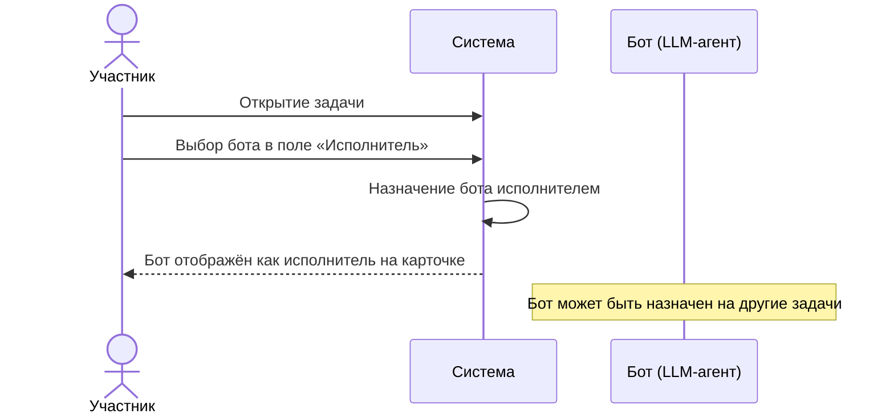

# Сценарии использования: Исполнители-боты

---

## UC-11-01: Назначение бота исполнителем
**Актор:** Участник проекта  
**Цель:** Назначить LLM-агента исполнителем задачи  
**Предусловия:** В проекте зарегистрирован хотя бы один бот, задача существует  
**Постусловия:** Бот назначен исполнителем задачи  

**Связанный сценарий:** [US-11-01](../userstory/11-bot-assignee.md#us-11-01)
